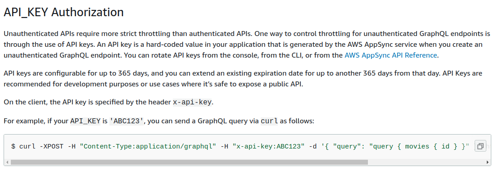

# Connecting to Appsync GraphQL API with Apollo Client

## Introduction

By this time we have had a lot of practice with gatsby and using GraphQL APIs made with `Apollo-Server`. Then we used them in the frontend with the help of `Apollo-Client`, `ApolloProvider` and `wrap-root-element` of gatsby.

The difference with AppSync is that we usually add some form of _authorization_. For now we have added `API_KEY` as the authorization type.

```javascript
authorizationType: appsync.AuthorizationType.API_KEY;
```

That means our AppSync backend will only respond to graphql requests that have a valid `API_KEY`. You can read about the different [types of authorization supported by AppSync](https://docs.aws.amazon.com/appsync/latest/devguide/security.html#aws-appsync-security).

## Creating the Backend API

**We will be using the same Appsync + Dynamodb backend that we saw in step04.**

## Preparing Gatsby frontend

### Hello world starter

```
gatsby new gatsby-frontend https://github.com/gatsbyjs/gatsby-starter-hello-world
```

#### Create the files

- `src/apollo/client.js`
- `src/wrap-root-element.js`
- `gatsby-browser.js`
- `gatsby-ssr.js`

#### Install the apollo client.

`yarn add @apollo/client graphql`

### Connecting to Appsync with header



You can see from this portion of the aws docs that on the client the API key is specified by the header `x-api-key`.
So when we are creating our `Apollo-Client` for use with `wrap-root-element` we will just add our api key as a header.

```javascript
// src/apollo/client.js

import fetch from "cross-fetch";
import { ApolloClient, InMemoryCache, HttpLink } from "@apollo/client";

export const client = new ApolloClient({
  link: new HttpLink({
    uri: "GRAPHQL_ENDPOINT", // ENTER YOUR GRAPHQL ENDPOINT HERE
    fetch,
    headers: {
      "x-api-key": "APPSYNC_API_KEY", // ENTER YOUR APPSYNC API KEY HERE
    },
  }),
  cache: new InMemoryCache(),
});
```

We will wrap our root element with the `ApolloProvider` and export it from `gatsby-browser` and `gatsby-ssr`

```javascript
// src/wrap-root-element.js
import React from "react";
import { ApolloProvider } from "@apollo/client";
import { client } from "./apollo/client";

export default ({ element }) => (
  <ApolloProvider client={client}>{element}</ApolloProvider>
);
```

```javascript
// gatsby-browser.js
export { default as wrapRootElement } from "./src/wrap-root-element";
```

```javascript
// gatsby-ssr.js
export { default as wrapRootElement } from "./src/wrap-root-element";
```

## Using the GraphQL API 

Now we can freely use all of the `@apollo/client` hooks like `useQuery`. This is the schema that we have deployed with AppSync:
```graphql
# graphql/schema.graphql
type Todo {
  id: ID!
  title: String!
  done: Boolean!
}

input TodoInput {
  id: ID!
  title: String!
  done: Boolean!
}

type Query {
  getTodos: [Todo]
}

type Mutation {
  addTodo(todo: TodoInput!): Todo
  updateTodo(todo: TodoInput!): Todo
  deleteTodo(todoId: String!): String
}

```

We can test it by using `getTodos` and other queries in our `index.js` page with Apollo Hooks. We can also test `addTodo` by installing `shortId` with `yarn add shortid`.
