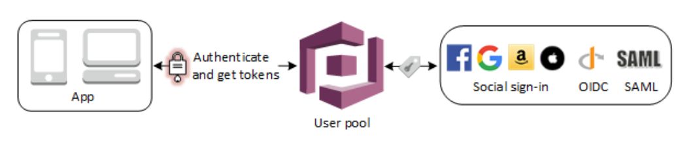

# Introduction

## Cognito User Pools

A user pool is a user directory in Amazon Cognito. With a user pool, your users can sign in to your web or mobile app through Amazon Cognito. Your users can also sign in through social identity providers like Google, Facebook, Amazon, or Apple, and through SAML identity providers. Whether your users sign in directly or through a third party, all members of the user pool have a directory profile that you can access through a Software Development Kit (SDK).

User pools provide:

- Sign-up and sign-in services.
- A built-in, customizable web UI to sign in users.
- Social sign-in with Facebook, Google, Login with Amazon, and Sign in with Apple, as well as sign-in with SAML identity providers from your user pool.
- User directory management and user profiles.
- Security features such as multi-factor authentication (MFA), checks for compromised credentials, account takeover protection, and phone and email verification.
- Customized workflows and user migration through AWS Lambda triggers.

After successfully authenticating a user, Amazon Cognito issues JSON web tokens (JWT) that you can use to secure and authorize access to your own APIs, or exchange for AWS credentials.

>User Pools

>  

Amazon Cognito provides token handling through the Amazon Cognito User Pools Identity SDKs for JavaScript, Android, and iOS. See [Getting Started](https://docs.aws.amazon.com/cognito/latest/developerguide/getting-started-with-cognito-user-pools.html) with User Pools and [Using Tokens with User Pools](https://docs.aws.amazon.com/cognito/latest/developerguide/amazon-cognito-user-pools-using-tokens-with-identity-providers.html).

The two main components of Amazon Cognito are user pools and identity pools. Identity pools provide AWS credentials to grant your users access to other AWS services. To enable users in your user pool to access AWS resources, you can configure an identity pool to exchange user pool tokens for AWS credentials. For more information see [Accessing AWS Services Using an Identity Pool After Sign-in](https://docs.aws.amazon.com/cognito/latest/developerguide/amazon-cognito-integrating-user-pools-with-identity-pools.html) and [Getting Started with Amazon Cognito Identity Pools (Federated Identities)](https://docs.aws.amazon.com/cognito/latest/developerguide/getting-started-with-identity-pools.html).

## Amazon Cognito Identity Pools (Federated Identities)

Amazon Cognito identity pools (federated identities) enable you to create unique identities for your users and federate them with identity providers. With an identity pool, you can obtain temporary, limited-privilege AWS credentials to access other AWS services. Amazon Cognito identity pools support the following identity providers:

- Public providers: Login with Amazon (Identity Pools), Facebook (Identity Pools), Google (Identity Pools), Sign in with Apple (Identity Pools).
- Amazon Cognito User Pools
- Open ID Connect Providers (Identity Pools)
- SAML Identity Providers (Identity Pools)
- Developer Authenticated Identities (Identity Pools)

For information about Amazon Cognito identity pools region availability, see [AWS Service Region Availability](https://aws.amazon.com/about-aws/global-infrastructure/regional-product-services/).

For more information on how to use AWS Cognito with AWS CDK [click here](https://docs.aws.amazon.com/cdk/api/latest/docs/aws-cognito-readme.html)

[Step 11 Video in English on Facebook](https://www.facebook.com/zeeshanhanif/videos/10225372583806438)

[Step 11 Video in English on YouTube](https://www.youtube.com/watch?v=vC33wJ6DfjQ)

[Step 11 Video in Urdu on Facebook](https://www.facebook.com/zeeshanhanif/videos/10225381665553476)

[Step 11 Video in Urdu on YouTube](https://www.youtube.com/watch?v=BXIWIUkl2tM)

[Step 11 Part 2 Video in English on Facebook](https://www.facebook.com/zeeshanhanif/videos/10225399426157480)

[Step 11 Part 2 Video in English on YouTube](https://www.youtube.com/watch?v=2y0QrhvRMew)

Step 11 Part 2 Video in Urdu on Facebook](https://www.facebook.com/zeeshanhanif/videos/10225407400396831)

[Step 11 Part 2 Video in Urdu on YouTube](https://www.youtube.com/watch?v=Qdk95pExTaY)

