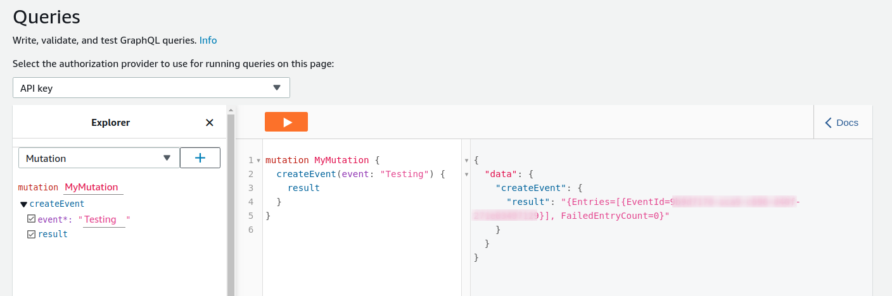
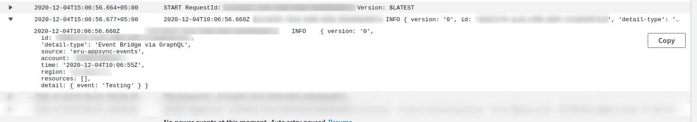

# Sending Events to Eventbridge from AppSync GraphQL APIs
## Dependencies
```
npm i @aws-cdk/aws-lambda @aws-cdk/aws-events @aws-cdk/aws-appsync @aws-cdk/aws-events-targets
```

## Introduction

Since we are interested in utilizing the benefits of GraphQL on the client side, our main entry point to the backend infrastructure is going to be AppSync. We also want to take advantage of **Event Driven Asynchronous Architecture**, for which we would like to generate custom events by sending queries/mutations to the GraphQL API from the frontend.

Normally with Appsync when we want to integrate some AWS service we use it as a **DataSource**. Like we have seen before with **DynamoDbDataSource** and **LambdaDataSource**. As of the time of writing this (**DECEMBER 2020**) we do not have any Eventbridge data source available to directly integrate with Appsync. Instead we will utilize the APIs that AWS provides for all of its services. We are going to do this by using an **HttpDataSource**. [You can read more about invoking AWS services from AppSync via HTTP from the docs](https://docs.aws.amazon.com/appsync/latest/devguide/tutorial-http-resolvers.html#invoking-aws-services).

## Eventbridge API

The specific API that we are interested in, is the [PutEvents API](https://docs.aws.amazon.com/eventbridge/latest/APIReference/API_PutEvents.html). We will need to send an Http POST request to the appropriate Eventbridge Endpoint. [Here is a list of all Eventbridge Endpoints](https://docs.aws.amazon.com/general/latest/gr/ev.html). The body of our request will contain an object like this:

```json
{
  "Entries": [
    {
      "Detail": "string",
      "DetailType": "string",
      "EventBusName": "string",
      "Resources": ["string"],
      "Source": "string",
      "Time": number
    }
  ]
}
```

Entries is an array that allows us to send upto 10 events in a batch. The actual payload of our event will go into the `Detail` field.

The response object will look something like :

```json
{
  "Entries": [
    {
      "ErrorCode": "string",
      "ErrorMessage": "string",
      "EventId": "string"
    }
  ],
  "FailedEntryCount": number
}
```

We will also need to send some Auth Headers which will be done through the CDK when we are defining the **HttpDataSource** and Resolvers.

## Implementation

1. Create API.
2. Add HttpDataSource.
3. Create Request and Response Mapping Templates (VTL).
4. Create Resolvers and Testing Lambda.
5. Add an eventbridge rule to target our Lambda.

### Creating API

```typescript
const api = new appsync.GraphqlApi(this, "Api", {
  name: "appsyncEventbridgeAPI",
  schema: appsync.Schema.fromAsset("schema/schema.graphql"),
  authorizationConfig: {
    defaultAuthorization: {
      authorizationType: appsync.AuthorizationType.API_KEY,
      apiKeyConfig: {
        expires: cdk.Expiration.after(cdk.Duration.days(365)),
      },
    },
  },
  logConfig: { fieldLogLevel: appsync.FieldLogLevel.ALL },
  xrayEnabled: true,
});
```

**Schema**

```graphql
type Event {
  result: String
}

type Query {
  getEvent: [Event]
}

type Mutation {
  createEvent(event: String!): Event
}
```

### Add HttpDataSource

Here we add the HttpDataSource and the required authorization config. The datasource is implemented to automatically use hte `signingServiceName` and `signingRegion` to form the correct headers. We also have to grant permission to our DataSource to be able to perform the `PutEvents` Action on EventBridge.

```typescript
// Create Http Data source that will put our event to the eventbus
const httpDs = api.addHttpDataSource(
  "ds",
  "https://events." + this.region + ".amazonaws.com/", // This is the ENDPOINT for eventbridge.
  {
    name: "httpDsWithEventBridge",
    description: "From Appsync to Eventbridge",
    authorizationConfig: {
      signingRegion: this.region,
      signingServiceName: "events",
    },
  }
);
events.EventBus.grantPutEvents(httpDs);
```

### Creating Mapping Templates

Now we need to define some way of translating our AppSync Queries to the proper Http request that is acceptable by Eventbridge. We will do this by using Mapping Templates which are written in `Apache VTL`. We create 2 files:

1. request.vtl
2. response.vtl

`request.vtl` is responsible for converting appsync request to http and `response.vtl` is responsible for converting the http response to appsync.

This is the code for `request.vtl`. Our payload will be going into the `Detail` field of each entry of the `Entries` array.

```vtl
{
  "version": "2018-05-29",
  "method": "POST",
  "resourcePath": "/",
  "params": {
    "headers": {
      "content-type": "application/x-amz-json-1.1",
      "x-amz-target":"AWSEvents.PutEvents"
    },
    "body": {
      "Entries":[
        {
          "Source":"eru-appsync-events",
          "EventBusName": "default",
          "Detail":"{ \"event\": \"$ctx.arguments.event\"}",
          "DetailType":"Event Bridge via GraphQL"
        }
      ]
    }
  }
}
```

Code for`response.vtl`. Notice here that since our createEvent mutation expects to return an object of type `Event` which has just one `result` field of type `string`. We are also returning a single object with a "result" field with value equal to a  single string which we are creating by parsing the response body and putting it inside a string. `"$util.parseJson($ctx.result.body)"` is just like doing json parse in template string from javascript instead of stringify.

```vtl
#if($ctx.error)
  $util.error($ctx.error.message, $ctx.error.type)
#end
#if($ctx.result.statusCode == 200)
  {
    "result": "$util.parseJson($ctx.result.body)"
  }
#else
  $utils.appendError($ctx.result.body, $ctx.result.statusCode)
#end
```

### Creating Resolvers

Now we just add a resolver for our `createEvent` Mutation.

```typescript
const putEventResolver = apiToEventBusDS.createResolver({
  typeName: "Mutation",
  fieldName: "createEvent",
  requestMappingTemplate: appsync.MappingTemplate.fromFile("request.vtl"),
  responseMappingTemplate: appsync.MappingTemplate.fromFile("response.vtl"),
});

const echoLambda = new lambda.Function(this, "echoFunction", {
  code: lambda.Code.fromInline(
    "exports.handler = (event, context) => { console.log(event); context.succeed(event); }"
  ),
  handler: "index.handler",
  runtime: lambda.Runtime.NODEJS_10_X,
});
```

### Adding Rule to Target Lambda

```typescript
const rule = new events.Rule(this, "AppSyncEventBridgeRule", {
  eventPattern: {
    source: ["eru-appsync-events"],
  },
});
rule.addTarget(new targets.LambdaFunction(echoLambda));
```

## Testing our API.

1. Go to Lambda Console and Select our Echo function and open the **View Cloudwatch Logs**. (Keep the logs open)
2. Go to the AppSync Console.
3. Run the createEvent Mutation.
4. Observe that the lambda logs will have a new entry.

This is what the mutation response looks like in the appsync console:


This is what you should see in the cloudwatch console logs:


## Cleanup
```
cdk destroy
```
