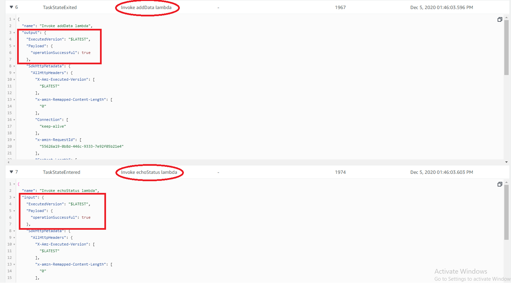

# Overview of concepts

This project implements a very simple step function that executes 2 lambda functions in a sequence as shown below

>State-machine flow diagram:

>  

The first lambda functions puts an item in the DynamoDb and returns { operationSuccessful: true } if the data was added successfully or { operationSuccessful: false } if the data was not added successfully.

The second lambda takes the expression returned from the first lambda "{ operationSuccessful: .... }" and logs the whether the operation was successful or not.

The image below shows how the output from the first lambda function was transferred to the second lambda function in its input by the step function.

>State-machine passing states:

>  

note: To test your step function go to the step-functions console and start the execution for your step function.For this example, you can enter anything in the starting input state as we are not utilizing it in our step function. However in a real-world application the initial starting state would mostly come from the event-bridge in the form of an event.

# Code explanation
