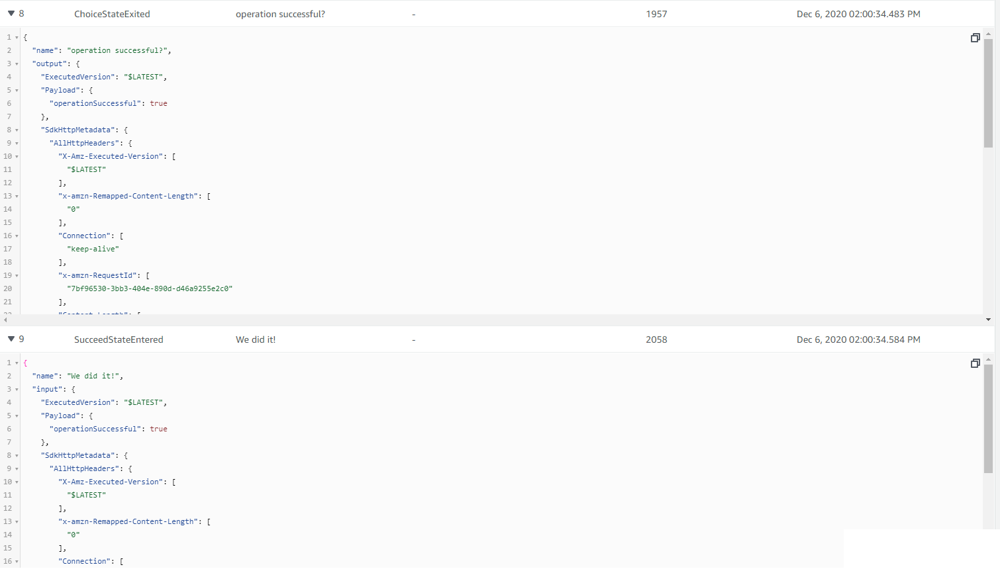

# Overview of concepts

This project implements a step function that first executes a lambda function and then a Choice state. The Choice state chooses its path based on the state it recieves from the lambda function. The Choice state can have 2 paths (Fail or Succeeded).

>State-machine flow diagram:

>  

The lambda function puts an item in the DynamoDb and returns { operationSuccessful: true } if the data was added successfully or { operationSuccessful: false } if the data was not added successfully.

## Choice state

A Choice state can take a different path through the workflow based on the values in the execution's JSON state. In this example it takes the the output of the lambda function { operationSucessful: .... } as input and chooses a path based on its "boolean" value. We have defined two different paths in this example (succeed and fail)

## Succeed state

Reaching a Succeed state terminates the state machine execution with a succesful status.

## Fail state

Reaching a Fail state terminates the state machine execution with a failure status. The fail state should report the reason for the failure.

## State Logs

The image below shows how the output from the lambda function was transferred to the Choice state in its input by the step function.

>State-machine passing states:

>  

The image below shows how the Choice state chose the Succeed state path based on the "operationSuccessful" value it recieved from the lambda function

>State-machine passing states:

>  

note: To test your step function go to the step-functions console and start the execution for your step function.For this example, you can enter anything in the starting input state as we are not utilizing it in our step function. However in a real-world application the initial starting state would mostly come from the event-bridge in the form of an event.


# Code explanation

## step 1

We created a lambda function called "addData"

```javascript

    const addData = new lambda.Function(this, "addData", {
      runtime: lambda.Runtime.NODEJS_10_X, // execution environment
      code: lambda.Code.fromAsset("lambda"), // code loaded from "lambda" directory
      handler: "addData.handler",
    });

```

The "addData" function adds an entry in the dynamodb. You can view the handler code in the "lamdba" directory

## step 2

Then we created Succeed and Fail states

```javascript

  // Reaching a Succeed state terminates the state machine execution with a succesful status.

    const success = new stepFunctions.Succeed(this, "We did it!");

    // Reaching a Fail state terminates the state machine execution with a failure status.

    const jobFailed = new stepFunctions.Fail(this, "Job Failed", {
      cause: "Lambda Job Failed",
      error: "could not add data to the dynamoDb",
    });
```

Note how we have also defined a cause and error for the fail state.

## step 3

Then we created a Choice state. This choice state takes the output of the lamdba function and if its true it runs the Succeed state and if its false it runss the Fail state.

```javascript

  // Here we are putting a condition to choose our next state. If the last state (lambdafn) returns {operationSuccessful: true}
    // then we end our state machine with a success state otherwise with a fail state

    const choice = new stepFunctions.Choice(this, "operation successful?");
    choice.when(
      stepFunctions.Condition.booleanEquals(
        "$.Payload.operationSuccessful",
        true
      ),
      success
    );
    choice.when(
      stepFunctions.Condition.booleanEquals(
        "$.Payload.operationSuccessful",
        false
      ),
      jobFailed
    );
```


## step 4

Then we created a chain for the step function. Chain defines the sequence of execution. In this example the chain executes the lambda function before the Choice state.

```javascript
// creating chain to define the sequence of execution

    const chain = stepFunctions.Chain.start(lambdafn).next(choice);
```

## step 5

Then we created our step function or our state machine and referenced our chain in it.

```javascript
// create a state machine

    new stepFunctions.StateMachine(this, "choiceStateMachine", {
      definition: chain,
    });
```
