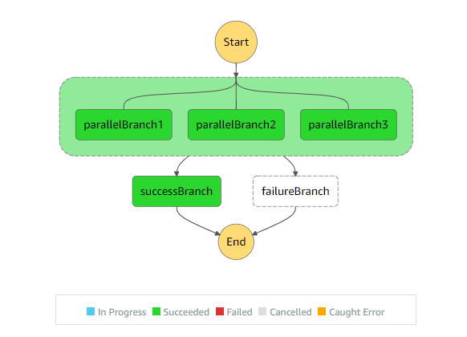
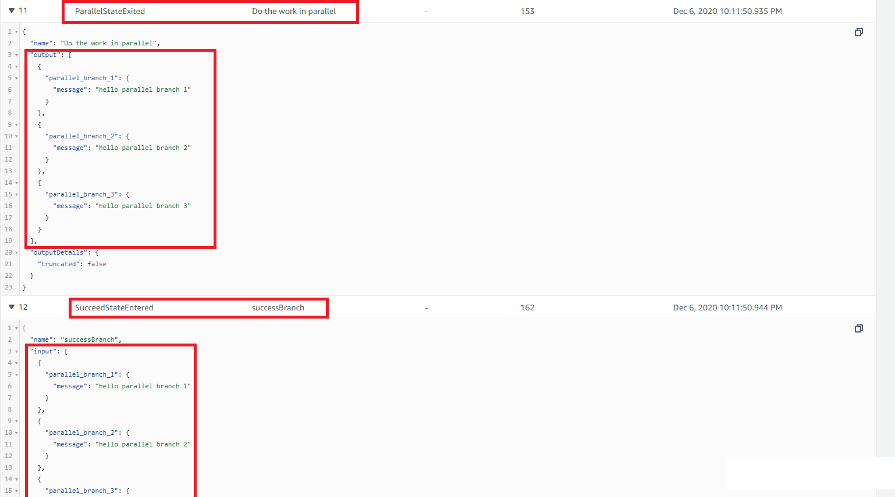

# Overview of concepts

This project implements a step function that executes branches in parallel. You can execute any state or operation in parallel but this example exectues 3 "Pass" branches to explain the "Parallel" operation.

>State-machine flow diagram:

>  

You can see in the image above that 3 branches are being executed in parallel. If all 3 run successfully then we run the "SuccessBranch" path. If there is an error in any one of the parallel branches then the entire "Parallel" state fails and the "failureBranch" runs. The "failureBranch" path comes very handy in error handling or rolling back or reverting changes.

## Parallel State

A Parallel state executes one or more subworkflows in parallel. It can also be used to catch and recover from errors in subworkflows.

## State Logs

>State-machine flow states:

> 


You can see in the above image that the output of the "Parallel" state combines the outputs from all the parallel branches.


# Code explanation

## step 1

We created 3 "Pass" states to run them simultaneously in the "Parallel" state

```javascript

   const parallelBranch1 = new stepFunctions.Pass(this, "parallelBranch1", {
      result: stepFunctions.Result.fromObject({
        message: "hello parallel branch 1",
      }),
      resultPath: "$.parallel_branch_1",
    });

    const parallelBranch2 = new stepFunctions.Pass(this, "parallelBranch2", {
      result: stepFunctions.Result.fromObject({
        message: "hello parallel branch 2",
      }),
      resultPath: "$.parallel_branch_2",
    });

    const parallelBranch3 = new stepFunctions.Pass(this, "parallelBranch3", {
      result: stepFunctions.Result.fromObject({
        message: "hello parallel branch 3",
      }),
      resultPath: "$.parallel_branch_3",
    });
```

This example is running "Pass" states in parallel only to simply the code. In real-life applications you would mostly be running lambda functions in parallel.

## step 2

Then we created failure and success paths. The failure path also runs a "Pass" state. The success path runs a "Succeed" state.

```javascript


    const failureBranch = new stepFunctions.Pass(this, "failureBranch", {
      result: stepFunctions.Result.fromObject({
        message: "hello failure branch",
      }),
      resultPath: "$.failure_branch",
    });

    const success = new stepFunctions.Succeed(this, "successBranch");

```

Here we are using a "Pass" state in the failure path just to explain the concept. In reality you would mostly use a lambda function here for error handling.

## step 3

Then we created our "Parrallel" state. 

```javascript

const parallel = new stepFunctions.Parallel(
      this,
      "Do the work in parallel"
    );

    // Add branches to be executed in parallel
    parallel.branch(parallelBranch1);
    parallel.branch(parallelBranch2);
    parallel.branch(parallelBranch3);

    // Retry the whole workflow if something goes wrong
    parallel.addRetry({ maxAttempts: 1 });

    // How to recover from errors
    parallel.addCatch(failureBranch);

    // What to do in case everything succeeded
    parallel.next(success);
```

After defining the parallel branches, we have also defined an "addRetry" function. This would try to run the "Parallel" state again if any errors occur.
If "addRetry" fails after making a certain number of attempts (1 in this example), we would go to the "addCatch" path where we are executing our "failureBranch" (error handling).

If no errors occur and all the branches execute successfully in parallel, then we run our "Success" path.

## step 4

Then we created a chain for the step function. Chain defines the sequence of execution. 

```javascript

    // create a chain

    const chain = stepFunctions.Chain.start(parallel);
```

## step 5

Then we created our step function or our state machine and referenced our chain in it.

```javascript
  // create a state machine

    new stepFunctions.StateMachine(this, "parallelStateMachine", {
      definition: chain,
    });
```
