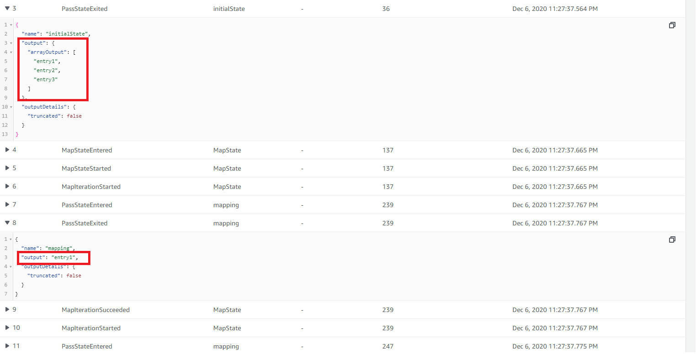

# Overview of concepts

This project implements a step function that introduces the concept of "Map" state. We have made 2 "Pass" states. The first one introduces an array in the state and the second one runs once for each element in the that array (just like the javascript map function)

>State-machine flow diagram:

>  

## Map State

A Map state can be used to run a set of steps for each element of an input array. A Map state will execute the same steps for multiple entries of an array in the state input.
While the Parallel state executes multiple branches of steps using the same input, a Map state will execute the same steps for multiple entries of an array in the state input.

## State Logs

>State-machine State:

> 


>State-machine State:

>


You can see in the images above that the first "Pass" state outputs an array of 3 elements. The second "Pass" state runs once for each element (taking that particular element in its input).


We have used "Pass" states in this project just to simplify the concept, however in the real-world applications you would mostly be using lambda functions in the "Map" state.


# Code explanation

## step 1

We first created an inital "Pass" state that injects an array in its output

```javascript

 // this initial "pass" function inserts an array in the output {}
    const initialState = new stepFunctions.Pass(this, "initialState", {
      result: stepFunctions.Result.fromArray(["entry1", "entry2", "entry3"]),
      resultPath: "$.arrayOutput",
    });
```

## step 2

We then created another "Pass" state that changes nothing in the state of the step function. This was done to simplify the code and explain the mapping process.

```javascript

 // this pass function doesnt change anything. We just made this to explain the mapping process

    const mapPass = new stepFunctions.Pass(this, "mapping");
```

## step 3

We then created our "Map" state. It runs the "Pass" state (that was made in step 2) three times, once for each element in the array that was introduced by the "Pass" state in step 1.

```javascript


    // this is a mapping function that runs 'mapPass' for each element in the state path {arrayOutput:[....]} coming
    // from the previous step. In this case we have 3 elements in the array therefore the "mapPass" would run 3 times.

    const map = new stepFunctions.Map(this, "MapState", {
      maxConcurrency: 1,
      itemsPath: stepFunctions.JsonPath.stringAt("$.arrayOutput"),
    });
    map.iterator(mapPass);
```

## step 4 

Then we created a chain for the step function. Chain defines the sequence of execution. 

```javascript

    // created a chain

    const chain = stepFunctions.Chain.start(initialState).next(map);
```

## step 5

Then we created our step function or our state machine and referenced our chain in it.

```javascript

 // create a state machine

    new stepFunctions.StateMachine(this, "mapStateMachine", {
      definition: chain,
    });
```
