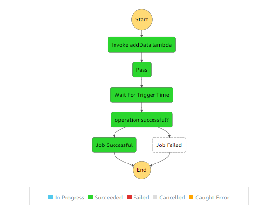

# Overview of concepts

This project implements a step function that gets invoked by an event generated by the Appsync.

>State-machine flow diagram:

>  

All the steps that you can see in the step function above have already been discussed in the previous steps, therefore, we will not go into their detail in this readme file.
The main aim of this step is to show you how to integrate step functions in an event-driven architecture.

The important thing to understand here is that the event goes as an input to the step function.

The code for generating an event through Appsync is similar to the code you have already seen in step13_eventbridge/events_from_appsync.

# Code explanation

## step 1

Creating Appsync API and adding a http data source to generate an event and then creating the resolver. This code is same as what you have seen in step13_eventbridge/events_from_appsync.

The following code will generate an event whenever the "createEvent" mutation is triggered.

```javascript

 // API
    const api = new appsync.GraphqlApi(this, "Api", {
      name: "appsyncEventbridgeAPI",
      schema: appsync.Schema.fromAsset("schema/schema.graphql"),
      authorizationConfig: {
        defaultAuthorization: {
          authorizationType: appsync.AuthorizationType.API_KEY,
          apiKeyConfig: {
            expires: cdk.Expiration.after(cdk.Duration.days(365)),
          },
        },
      },
      logConfig: { fieldLogLevel: appsync.FieldLogLevel.ALL },
      xrayEnabled: true,
    });

    // HTTP DATASOURCE
    const httpDs = api.addHttpDataSource(
      "ds",
      "https://events." + this.region + ".amazonaws.com/", // This is the ENDPOINT for eventbridge.
      {
        name: "httpDsWithEventBridge",
        description: "From Appsync to Eventbridge",
        authorizationConfig: {
          signingRegion: this.region,
          signingServiceName: "events",
        },
      }
    );
    events.EventBus.grantPutEvents(httpDs);
    
      // RESOLVER
    const putEventResolver = httpDs.createResolver({
      typeName: "Mutation",
      fieldName: "createEvent",
      requestMappingTemplate: appsync.MappingTemplate.fromFile("request.vtl"),
      responseMappingTemplate: appsync.MappingTemplate.fromFile("response.vtl"),
    });

```

## step 2

After that we created our step function. You can see that the first step in the step function is a lambda function. Therefore, the event (that invokes the step function) becomes the inital input of the step function and goes as input to the lambda function.

```javascript

  // created a dynamodb Table

    const DynamoTable = new ddb.Table(this, "DynamoTable", {
      partitionKey: {
        name: "id",
        type: ddb.AttributeType.STRING,
      },
    });

    // this function adds data to the dynamoDB table

    const addData = new lambda.Function(this, "addData", {
      runtime: lambda.Runtime.NODEJS_10_X, // execution environment
      code: lambda.Code.fromAsset("lambda"), // code loaded from "lambda" directory
      handler: "addData.handler",
    });

    // giving access to the lambda function to do operations on the dynamodb table

    DynamoTable.grantFullAccess(addData);
    addData.addEnvironment("DynamoTable", DynamoTable.tableName);

    const firstStep = new stepFunctionTasks.LambdaInvoke(
      this,
      "Invoke addData lambda",
      {
        lambdaFunction: addData,
      }
    );

    // pass state

    const pass = new stepFunctions.Pass(this, "Pass", {
      result: stepFunctions.Result.fromObject({ triggerTime: 2 }),
      resultPath: "$.passObject",
    });

    // wait state

    const wait = new stepFunctions.Wait(this, "Wait For Trigger Time", {
      time: stepFunctions.WaitTime.secondsPath("$.passObject.triggerTime"),
    });

    // Reaching a Succeed state terminates the state machine execution with a succesful status.

    const success = new stepFunctions.Succeed(this, "Job Successful");

    // Reaching a Fail state terminates the state machine execution with a failure status.

    const jobFailed = new stepFunctions.Fail(this, "Job Failed", {
      cause: "Lambda Job Failed",
      error: "could not add data to the dynamoDb",
    });

    // choice state

    const choice = new stepFunctions.Choice(this, "operation successful?");
    choice.when(
      stepFunctions.Condition.booleanEquals(
        "$.Payload.operationSuccessful",
        true
      ),
      success
    );
    choice.when(
      stepFunctions.Condition.booleanEquals(
        "$.Payload.operationSuccessful",
        false
      ),
      jobFailed
    );

    // creating chain to define the sequence of execution

    const chain = stepFunctions.Chain.start(firstStep)
      .next(pass)
      .next(wait)
      .next(choice);

    // create a state machine

    const stepFn = new stepFunctions.StateMachine(
      this,
      "stateMachineEventDriven",
      {
        definition: chain,
      }
    );


```

## step 3

Then we created an event bridge rule so that whenver the event is generated by the Appsync, step functions listens to it and starts its operation. Eventbridge rule has also been covered in the previous step 13 in great detail.

```javascript

// creating rule to invoke step function on event

    const rule = new events.Rule(this, "AppSyncStepFnRule", {
      eventPattern: {
        source: ["appsync-events"],
      },
    });

    rule.addTarget(new targets.SfnStateMachine(stepFn));
```
