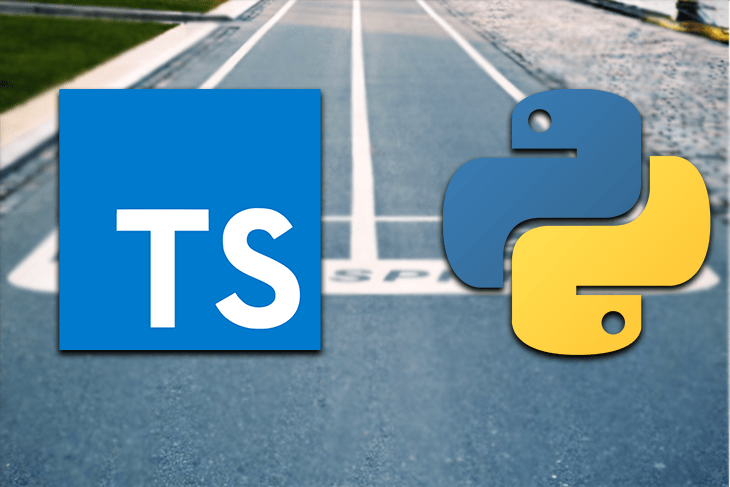

TypeScript was the first language supported for developing AWS CDK applications as CDK infrastructure is built in Typescript, and there is a substantial amount of example CDK code written in TypeScript. We have kept the main cdk stack code in Typescript and changed the rest into Python, mainly lambda function code.
Reference article:
[Which programming language is best for aws-cdk ](https://awsmaniac.com/which-programming-language-is-the-best-for-aws-cdk/)

[working with python in CDK](https://docs.aws.amazon.com/cdk/latest/guide/work-with-cdk-python.html)

# AWS CDK idioms in Python
## [AWS CDK idioms in Python](https://docs.aws.amazon.com/cdk/latest/guide/work-with-cdk-python.html)

