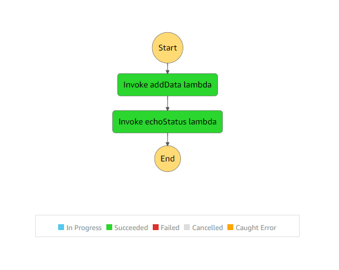

# Overview of concepts

This project implements a very simple step function that executes 2 lambda functions in a sequence as shown below

>State-machine flow diagram:

>  

The first lambda functions puts an item in the DynamoDb and returns { operationSuccessful: true } if the data was added successfully or { operationSuccessful: false } if the data was not added successfully.

The second lambda takes the expression returned from the first lambda "{ operationSuccessful: .... }" and logs the whether the operation was successful or not.

The image below shows how the output from the first lambda function was transferred to the second lambda function in its input by the step function.

>State-machine passing states:

>  

note: To test your step function go to the step-functions console and start the execution for your step function.For this example, you can enter anything in the starting input state as we are not utilizing it in our step function. However in a real-world application the initial starting state would mostly come from the event-bridge in the form of an event.


# Code explanation

## step 1

We created two lambda functions.

```javascript
  // this function adds data to the dynamoDB table

    const addData = new lambda.Function(this, "addData", {
      runtime: lambda.Runtime.NODEJS_10_X, // execution environment
      code: lambda.Code.fromAsset("lambda"), // code loaded from "lambda" directory
      handler: "addData.handler",
    });

    // this function logs the status of the operation

    const echoStatus = new lambda.Function(this, "echoStatus", {
      runtime: lambda.Runtime.NODEJS_10_X, // execution environment
      code: lambda.Code.fromAsset("lambda"), // code loaded from "lambda" directory
      handler: "echoStatus.handler",
    });
```

The "addData" function adds an entry in the dynamodb and "echoStatus" logs the data it recieves. You can view the code of lambda handlers in the "lambda" directory.

## step 2

Then we declared those lambda functions as tasks for the step function. A Task in step functions represents some work that needs to be done.

```javascript

    const firstStep = new stepFunctionTasks.LambdaInvoke(
      this,
      "Invoke addData lambda",
      {
        lambdaFunction: addData,
      }
    );

    const secondStep = new stepFunctionTasks.LambdaInvoke(
      this,
      "Invoke echoStatus lambda",
      {
        lambdaFunction: echoStatus,
        inputPath: "$.Payload",
      }
    );
```
Note that we have also defined an inputPath for the second lambda function. Input and output paths are optional parameters that are used to filter out the required keys from the state object. Like in this example we only want "Payload" as an input instead of the entire Json state for our "echoStatus" function.

## step 3

Then we created a chain for the step function. Chain defines the sequence of execution. In this example the chain executes "addData" function before the "echoStatus" function.

```javascript
// creating chain to define the sequence of execution

    const chain = stepFunctions.Chain.start(firstStep).next(secondStep);
```

## step 4

Then we created our step function or our state machine and referenced our chain in it.

```javascript
// create a state machine

    new stepFunctions.StateMachine(this, "simpleStateMachine", {
      definition: chain,
    });
```
