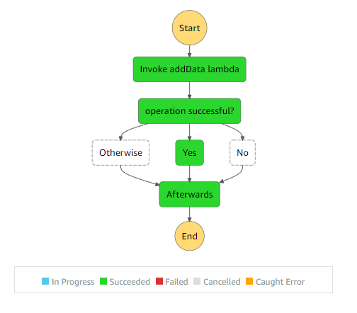

# Overview of concepts

This project implements a more advanced version of the Choice state. In this example we are using using lambda functions instead of "Succeed" and "Fail" states. 

>State-machine flow diagram:

>  

The "addData" lambda function puts an item in the DynamoDb and returns { operationSuccessful: true } if the data was added successfully or { operationSuccessful: false } if the data was not added successfully.

If the "operationSuccessful" returned by the "addData" lambda is true then the "Choice" state runs the "addDataSuccess" lambda function which merely logs "operation successful". If "operationSuccessful" returns false, the "Choice" state runs "addDataFailed" which logs "operation failed".

We have also implemented a "Otherwise" path for the "Choice" state which executes a "Pass" state. This would only run if both of the above conditions are not met. 

We have also implemented a "Afterwards" path for the "Choice" state which runs everytime regardless of the choice made. In this example the "Afterwards" path executes a "Pass" state.

# Code explanation

## step 1

We created 3 lambda functions.

```javascript

  
    // this function adds data to the dynamoDB table

    const addData = new lambda.Function(this, "addData", {
      runtime: lambda.Runtime.NODEJS_10_X, // execution environment
      code: lambda.Code.fromAsset("lambda"), // code loaded from "lambda" directory
      handler: "addData.handler",
    });

    // this function prints "operation failed"

    const addDataFailed = new lambda.Function(this, "addDataFailed", {
      runtime: lambda.Runtime.NODEJS_10_X, // execution environment
      code: lambda.Code.fromAsset("lambda"), // code loaded from "lambda" directory
      handler: "addDataFailed.handler",
    });

    // this function prints "operation successful"

    const addDataSuccess = new lambda.Function(this, "addDataSuccess", {
      runtime: lambda.Runtime.NODEJS_10_X, // execution environment
      code: lambda.Code.fromAsset("lambda"), // code loaded from "lambda" directory
      handler: "addDataSuccess.handler",
    });


```

The "addData" function adds an entry in the dynamodb. The other two functions only log the status. You can view their handler code in the "lamdba" directory

## step 2

Then we declared those lambda functions as tasks for the step function. A Task in step functions represents some work that needs to be done.

```javascript

   const addDataInvoke = new stepFunctionTasks.LambdaInvoke(
      this,
      "Invoke addData lambda",
      {
        lambdaFunction: addData,
      }
    );

    const addDataFailedInvoke = new stepFunctionTasks.LambdaInvoke(this, "No", {
      lambdaFunction: addDataFailed,
    });

    const addDataSuccessInvoke = new stepFunctionTasks.LambdaInvoke(
      this,
      "Yes",
      {
        lambdaFunction: addDataSuccess,
      }
    );
```

## step 3

Then we created two "Pass" states for the "Otherwise" and "Afterwards" paths.

```javascript

    const otherwisePass = new stepFunctions.Pass(this, "Otherwise", {
      result: stepFunctions.Result.fromObject({
        message: "Otherwise Executed",
      }),
      resultPath: "$.output.otherwise",
    });

    const afterwardsPass = new stepFunctions.Pass(this, "Afterwards", {
      result: stepFunctions.Result.fromObject({
        message: "Afterwards Executed",
      }),
      resultPath: "$.output.afterwards",
    });

```

Note that each of these "Pass" states add a message to their output state. 

## step 4

Then we added our "Choice" state. 

```javascript
    const choice = new stepFunctions.Choice(this, "operation successful?");
    choice.when(
      stepFunctions.Condition.booleanEquals(
        "$.Payload.operationSuccessful",
        true
      ),
      addDataSuccessInvoke
    );
    choice.when(
      stepFunctions.Condition.booleanEquals(
        "$.Payload.operationSuccessful",
        false
      ),
      addDataFailedInvoke
    );

    // If the last state (addData) returns neither {operationSuccessful: true} nor {operationSuccessful: false}
    // then the "otherwisePass" executes. In this application this never happens. You can change the return value of the "addData"
    // lambda function to test this state

    choice.otherwise(otherwisePass);

    // this always runs after the choice operation

    choice.afterwards().next(afterwardsPass);

```

Note that the "Otherwise" path would never run in this example because one of the above conditions would always be true. However, it is a good practice to add an "Otherwise" path for error handling and keeping your flow from breaking in more complex projects.

## step 5

Then we created a chain for the step function. Chain defines the sequence of execution. In this example the chain executes the lambda function before the Choice state.

```javascript
    // creating chain to define the sequence of execution

    const chain = stepFunctions.Chain.start(addDataInvoke).next(choice);
```

## step 6

Then we created our step function or our state machine and referenced our chain in it.

```javascript
 // create a state machine

    new stepFunctions.StateMachine(this, "choiceStateMachine", {
      definition: chain,
    });
```
