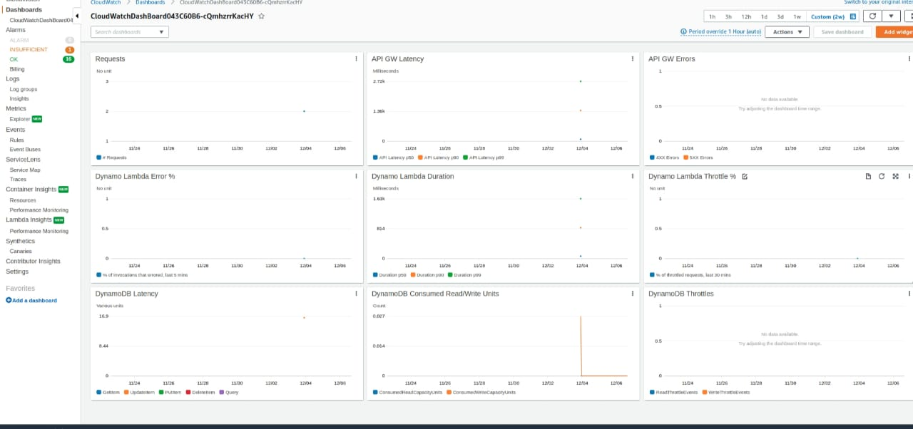

# Cloudwatch Dashboard CDK

In this step we will create a custom cloudwatch dashboard.Dashboards are set of Widgets stored server-side which can be accessed quickly from the AWS console. Available widgets are graphs of a metric over time, the current value of a metric, or a static piece of Markdown which explains what the graphs mean.c.You can view a Dashboard in AWS cloudwatch dashboard pannel after deploying the code.
>  

# Code Explanation

### Step 1: Setup a CDK directory
`cdk init app --language typescript`

### Step2: Install following dependencies

`npm i @aws-cdk/aws-apigatewayv2`

`npm i @aws-cdk/aws-apigatewayv2-integrations`

`npm i @aws-cdk/aws-cloudwatch`

`npm i @aws-cdk/aws-lambda`

### Step3: Setup Lambda function
Create a new folder as **lambda** in the cdk root dir and add a file as **lambda.ts**.
```javascript
// lambda-fns/lambda.ts

const { DynamoDB, Lambda } = require('aws-sdk');

exports.handler = async function (event: any) {
    console.log("request:", JSON.stringify(event, undefined, 2));

    // create AWS SDK clients
    const dynamo = new DynamoDB();

    // update dynamo entry for "path" with hits++
    await dynamo.updateItem({
        TableName: process.env.HITS_TABLE_NAME,
        Key: { path: { S: event.rawPath } },
        UpdateExpression: 'ADD hits :incr',
        ExpressionAttributeValues: { ':incr': { N: '1' } }
    }).promise();

    console.log('inserted counter for ' + event.rawPath);

    // return response back to upstream caller
    return sendRes(200, 'You have connected with the Lambda!');
};

const sendRes = (status: number, body: string) => {
    var response = {
        statusCode: status,
        headers: {
            "Content-Type": "text/html"
        },
        body: body
    };
    return response;
};
```
### Step4: Setup Your Api Gateway,Lambda and DynamoDB
```javascript
// lib/step00_cloudwatch_alarm-stack.ts.ts

import * as cdk from '@aws-cdk/core';
import lambda = require('@aws-cdk/aws-lambda');
import dynamodb = require('@aws-cdk/aws-dynamodb');
import apigw = require('@aws-cdk/aws-apigatewayv2');
import integrations = require('@aws-cdk/aws-apigatewayv2-integrations');

export class Stack extends cdk.Stack {
  constructor(scope: cdk.Construct, id: string, props?: cdk.StackProps) {
    super(scope, id, props);

     // DynamoDB Table
    const table = new dynamodb.Table(this, 'Hits', {
      partitionKey: { name: 'path', type: dynamodb.AttributeType.STRING },
      billingMode: dynamodb.BillingMode.PAY_PER_REQUEST
    });

    // Lambda to interact with DynamoDB
    const dynamoLambda = new lambda.Function(this, 'DynamoLambdaHandler', {
      runtime: lambda.Runtime.NODEJS_12_X,
      code: lambda.Code.fromAsset('lambda'),
      handler: 'lambda.handler',
      environment: {
        HITS_TABLE_NAME: table.tableName
      }
    });

    // grant the lambda role read/write permissions to our table
    table.grantReadWriteData(dynamoLambda);

    // defines an API Gateway Http API resource backed by our "dynamoLambda" function.
    let api = new apigw.HttpApi(this, 'HttpAPI', {
      defaultIntegration: new integrations.LambdaProxyIntegration({
        handler: dynamoLambda
      })
    });

  }
}
```
### Step5: Add a Method to build Metric Object
Add the following snippet of code.This take metric name,namespace,dimensions and unit etc as input and returns a metric object.Metric objects represent a metric that is emitted by AWS services or your own application, such as CPUUsage, FailureCount or Bandwidth.

```javascript

 private buildMetric(metricName: string, namespace: string, dimensions: any, unit: cloudwatch.Unit, label: string, stat = 'avg', period = 900): cloudwatch.Metric {
    return new cloudwatch.Metric({
      metricName, //Name of this metric.
      namespace: namespace, //Namespace of this metric.
      dimensions: dimensions, //Dimensions of this metric.
      unit: unit, //Unit of the metric.
      label: label, //Label for this metric when added to a Graph in a Dashboard.
      statistic: stat, //Statistic of this metric.
      period: cdk.Duration.seconds(period) //Aggregation period of this metric.
    });

```
### Step6: Add a Method to call buildMetric
Add the following snippet of code.This take metricName,apiId and label as input and calls buildMetric.

```javascript

private metricForApiGw(apiId: string, metricName: string, label: string, stat = 'avg'): cloudwatch.Metric {
    let dimensions = {
      ApiId: apiId
    };
    return this.buildMetric(metricName, 'AWS/ApiGateway', dimensions, cloudwatch.Unit.COUNT, label, stat);
  }


```
### Step7: Add a Method to build Dashboard Widget
Add the following snippet of code.This take widgetName and metrics as input and creates a widget.

```javascript

  private buildGraphWidget(widgetName: string, metrics: IMetric[]): GraphWidget {
    return new GraphWidget({
      title: widgetName, //Title for the widget.
      left: metrics,//This will display metrics on left vertical axis.
      width: 8 //The amount of horizontal grid units the widget will take up.
    });
  }

```
### Step8: Add Math Expressions
Add the following snippet of code.We will do metric math here.Metric math enables you to query multiple CloudWatch metrics and use math expressions to create new time series based on these metrics. You can visualize the resulting time series on the CloudWatch console and add them to dashboards. Using AWS Lambda metrics as an example, you could divide the Errors metric by the Invocations metric to get an error rate. Then add the resulting time series to a graph on your CloudWatch dashboard.

```javascript

let apiGateway4xxErrorPercentage = new cloudwatch.MathExpression({
      expression: 'm1/m2*100',
      label: '% API Gateway 4xx Errors',
      usingMetrics: {
        m1: this.metricForApiGw(api.httpApiId, '4XXError', '4XX Errors', 'sum'),
        m2: this.metricForApiGw(api.httpApiId, 'Count', '# Requests', 'sum'),
      },
      period: cdk.Duration.minutes(5)
    });

    // Gather the % of lambda invocations that error in past 5 mins
    let dynamoLambdaErrorPercentage = new cloudwatch.MathExpression({
      expression: 'e / i * 100',
      label: '% of invocations that errored, last 5 mins',
      usingMetrics: {
        i: dynamoLambda.metric("Invocations", { statistic: 'sum' }),
        e: dynamoLambda.metric("Errors", { statistic: 'sum' }),
      },
      period: cdk.Duration.minutes(5)
    });

    // note: throttled requests are not counted in total num of invocations
    let dynamoLambdaThrottledPercentage = new cloudwatch.MathExpression({
      expression: 't / (i + t) * 100',
      label: '% of throttled requests, last 30 mins',
      usingMetrics: {
        i: dynamoLambda.metric("Invocations", { statistic: 'sum' }),
        t: dynamoLambda.metric("Throttles", { statistic: 'sum' }),
      },
      period: cdk.Duration.minutes(5)
    });

    // I think usererrors are at an account level rather than a table level so merging
    // these two metrics until I can get a definitive answer. I think usererrors
    // will always show as 0 when scoped to a table so this is still effectively
    // a system errors count
    let dynamoDBTotalErrors = new cloudwatch.MathExpression({
      expression: 'm1 + m2',
      label: 'DynamoDB Errors',
      usingMetrics: {
        m1: table.metricUserErrors(),
        m2: table.metricSystemErrorsForOperations(),
      },
      period: cdk.Duration.minutes(5)
    });

    // Rather than have 2 alerts, let's create one aggregate metric
    let dynamoDBThrottles = new cloudwatch.MathExpression({
      expression: 'm1 + m2',
      label: 'DynamoDB Throttles',
      usingMetrics: {
        m1: table.metric('ReadThrottleEvents', { statistic: 'sum' }),
        m2: table.metric('WriteThrottleEvents', { statistic: 'sum' }),
      },
      period: cdk.Duration.minutes(5)
    });


```

### Step9: Create a Dashboard
Add the following snippet of code.This will create a dashboard.We can add a lot of widgets in the dashboard.

```javascript

    new cloudwatch.Dashboard(this, 'CloudWatchDashBoard').addWidgets(
      this.buildGraphWidget('Requests', [
        this.metricForApiGw(api.httpApiId, 'Count', '# Requests', 'sum')
      ]),
      this.buildGraphWidget('API GW Latency', [
        this.metricForApiGw(api.httpApiId, 'Latency', 'API Latency p50', 'p50'),
        this.metricForApiGw(api.httpApiId, 'Latency', 'API Latency p90', 'p90'),
        this.metricForApiGw(api.httpApiId, 'Latency', 'API Latency p99', 'p99')
      ], true),
      this.buildGraphWidget('API GW Errors', [
        this.metricForApiGw(api.httpApiId, '4XXError', '4XX Errors', 'sum'),
        this.metricForApiGw(api.httpApiId, '5XXError', '5XX Errors', 'sum')
      ], true),
      this.buildGraphWidget('Dynamo Lambda Error %', [dynamoLambdaErrorPercentage]),
      this.buildGraphWidget('Dynamo Lambda Duration', [
        dynamoLambda.metricDuration({ statistic: "p50" }),
        dynamoLambda.metricDuration({ statistic: "p90" }),
        dynamoLambda.metricDuration({ statistic: "p99" })
      ], true),
      this.buildGraphWidget('Dynamo Lambda Throttle %', [dynamoLambdaThrottledPercentage]),
      this.buildGraphWidget('DynamoDB Latency', [
        table.metricSuccessfulRequestLatency({ dimensions: { "TableName": table.tableName, "Operation": "GetItem" } }),
        table.metricSuccessfulRequestLatency({ dimensions: { "TableName": table.tableName, "Operation": "UpdateItem" } }),
        table.metricSuccessfulRequestLatency({ dimensions: { "TableName": table.tableName, "Operation": "PutItem" } }),
        table.metricSuccessfulRequestLatency({ dimensions: { "TableName": table.tableName, "Operation": "DeleteItem" } }),
        table.metricSuccessfulRequestLatency({ dimensions: { "TableName": table.tableName, "Operation": "Query" } }),
      ], true),
      this.buildGraphWidget('DynamoDB Consumed Read/Write Units', [
        table.metric('ConsumedReadCapacityUnits'),
        table.metric('ConsumedWriteCapacityUnits')
      ], false),
      this.buildGraphWidget('DynamoDB Throttles', [
        table.metric('ReadThrottleEvents', { statistic: 'sum' }),
        table.metric('WriteThrottleEvents', { statistic: 'sum' })
      ], true)
    )

```


