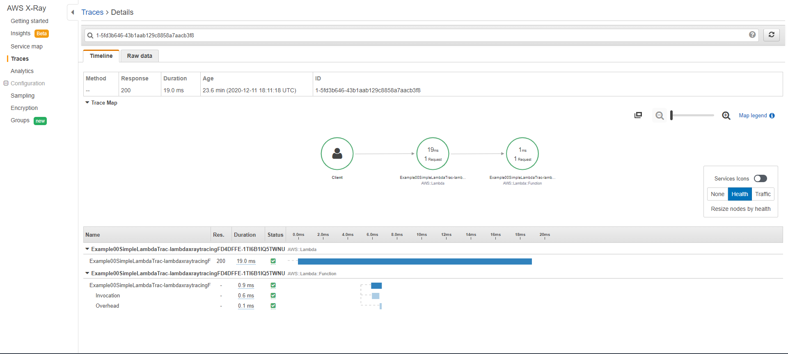

## Introduction

In this Step, we are going to create a simple lambda function and Invoke it from aws lambda console so our Lambda function send trace data to X-Ray, and X-Ray processes the data to generate a service map and searchable trace summaries.

## Step 1

- Create a [new CDK project](https://github.com/panacloud-modern-global-apps/full-stack-serverless-cdk/tree/main/step00_hello_cdk).
- Make a new Lambda construct on your stack

```typescript
new lambda.Function(this, "lambda-x-ray-tracing", {
  runtime: lambda.Runtime.NODEJS_10_X,
  code: lambda.Code.fromAsset("lambda"),
  handler: "app.handler",
  // Enabling X-Ray Tracing
  tracing: lambda.Tracing.ACTIVE,
});
```

## Step 2

Add the handler code for your lambda in your lambda file in my case it's `lambda/app.ts`.
install aws-lambda types package. `npm install @types/aws-lambda`.

```typescript
//lambda/app.ts
import { APIGatewayEvent } from "aws-lambda";

exports.handler = async (event: APIGatewayEvent) => {
  return {
    statusCode: 200,
    body: "Hello World",
  };
};
```

## Step 3

Now our function is ready to deploy.

1. build the project.

```bash
npm run build
```

2. deploy it on cloudformation

```bash
cdk deploy
```

## Step 4

1. Open your [AWS Lambda Console](https://console.aws.amazon.com/lambda/home?region=us-east-1#/functions)(make sure you are in the correct region).
2. Select the function which we created above.
3. Configure test event.
4. Test it multiple times to get multiple traces on X-Ray.

## Step 5

Now switch over to X-Ray. refresh the service map to see some initial trace data resulting from our recent test activity.


X-Ray uses the traces that it has collected to generate this service map. the map shows the paths that the requests take in the application, and the time it takes to complete the requests. notice that there are two nodes shown on this service map one for the lambda invocation and the other one is for lambda execution.


By selecting one of the nodes provides you more details about the service from here you can drill down and view the individual traces that have been collected by clicking on `view traces` option.

## Step 6

#### Select any trace by its ID to view more details about it.



#### this screen shows you more detailed timeline about each of these segments in your application
