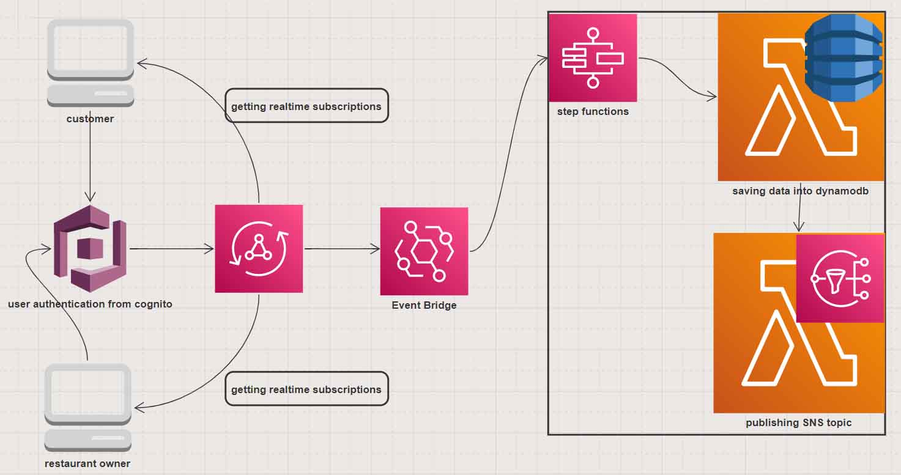

# Event Driven Restaurant App

In this step we are going to make an event driven decoupled restaurant app. For event base architecture we will be using a well known AWS service called Amazon EventBridge which is a serverless event bus that makes it easy to connect applications together using data from your own applications, integrated Software-as-a-Service (SaaS) applications, and AWS services. EventBridge delivers a stream of real-time data from event sources, such as Zendesk, Datadog, or Pagerduty, and routes that data to targets like AWS Lambda. You can set up routing rules to determine where to send your data to build application architectures that react in real time to all of your data sources. Lets start this example first by deploying [cdk-backend](./cdk-backend).

### Learn more about AWS Eventbridge from the following links:

- [Amazon EventBridge](https://aws.amazon.com/eventbridge/)

- https://github.com/panacloud-modern-global-apps/full-stack-serverless-cdk/tree/main/step15_eventbridge

[Operating Lambda: Design principles in event-driven architectures – Part 2](https://aws.amazon.com/blogs/compute/operating-lambda-design-principles-in-event-driven-architectures-part-2/)
