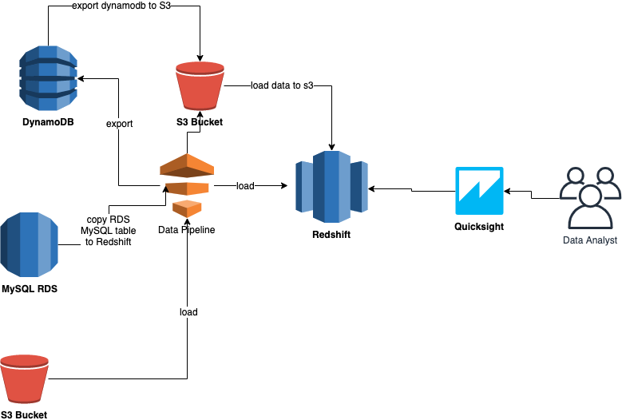

# Amazon Redshift

Amazon Redshift is a fully managed, petabyte-scale data warehouse service in the cloud. You can start with just a few hundred gigabytes of data and scale to a petabyte or more. This enables you to use your data to acquire new insights for your business and customers.

The first step to create a data warehouse is to launch a set of nodes, called an Amazon Redshift cluster. After you provision your cluster, you can upload your data set and then perform data analysis queries. Regardless of the size of the data set, Amazon Redshift offers fast query performance using the same SQL-based tools and business intelligence applications that you use today.

## Useful Links

- [Amazon Redshift](https://docs.aws.amazon.com/redshift/latest/mgmt/welcome.html)
- [Redshift Quick Guide](https://docs.aws.amazon.com/redshift/latest/gsg/getting-started.html)
- [How to connect Redshift to SQL Client](https://docs.aws.amazon.com/redshift/latest/mgmt/connecting-to-cluster.html)
