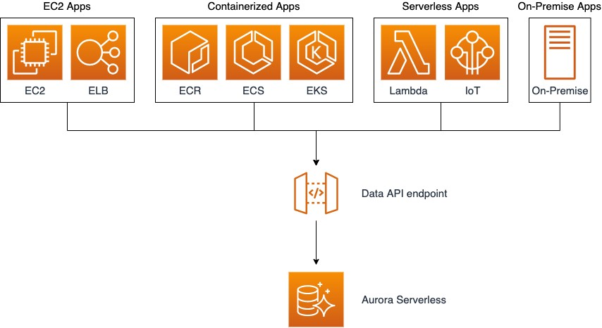

# [AMAZON AURORA SERVERLESS](https://github.com/panacloud-modern-global-apps/full-stack-serverless-cdk/blob/main/step38_aurora_serverless/README.md)

## Using the Data API for Aurora Serverless

By using the Data API for Aurora Serverless, you can work with a web-services interface to your Aurora Serverless DB cluster. The Data API doesn't require a persistent connection to the DB cluster. Instead, it provides a secure HTTP endpoint and integration with AWS SDKs. You can use the endpoint to run SQL statements without managing connections.

