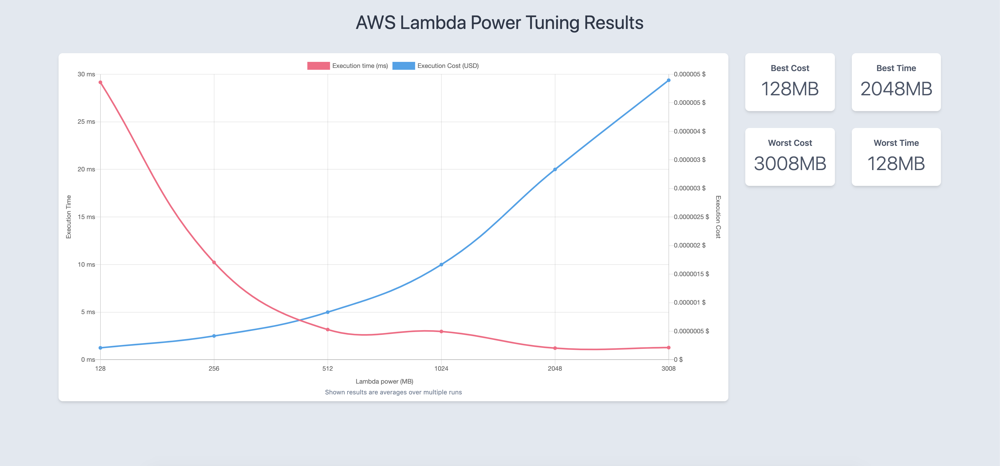

# The Lambda Power Tuner

AWS Lambda Power Tuning is an AWS Step Functions state machine that helps you optimize your Lambda functions in a data-driven way.

The state machine is designed to be quick and language agnostic. You can provide any Lambda function as input and the state machine will run it with multiple power configurations (from 128MB to 3GB), analyze execution logs and suggest you the best configuration to minimize cost or maximize performance.

The input function will be executed in your AWS account - performing real HTTP calls, SDK calls, cold starts, etc. The state machine also supports cross-region invocations and you can enable parallel execution to generate results in just a few seconds. Optionally, you can configure the state machine to automatically optimize the function and the end of its execution.

The reason for doing this is that it helps with two of the Serverless Well Architected pillars:

- Performance Efficiency Pillar
- Cost Optimization Pillar

## Default Configuration Settings Provided

There are some variables that you can pass into the SAR app to manipulate the power tuning step function.

```typescript
let powerValues = "128,256,512,1024,1536,3008";
let lambdaResource = "*";
```

the powerValues lets you pick exactly what AWS Lambda memory settings you want to tune against. The full list of allowed values is:

```
['128','192','256','320','384','448','512','576','640','704','768','832','896','960','1024','1088','1152','1216','1280','1344','1408','1472','1536','3008']
```

lambdaResource is about what IAM permissions do you want to give the state machine? In general, you want to give your components the least privileges they require to reduce their blast radius.

By default the power tuner uses \* permissions which means that it has wide scope and can tune any function. However you can limit the scope of the lambdaResource by either restricting it to region or by restricting it to specific lambda ARN as follows

```typescript
let lambdaResource = lambdaFunction.functionArn;
```

## How To Test This Pattern

After deployment, navigate to the step functions section of the AWS Console.

from the list of availabe state machines, pick the power tuner state machine.

Now click "start execution" in the top right

In the input field enter the following JSON and add in the ARN to the lambda you want to test.

```
{
  "lambdaARN": "your lambda arn to test",
  "powerValues": [
    128,
    256,
    512,
    1024,
    2048,
    3008
  ],
  "num": 10,
  "payload": {},
  "parallelInvocation": true,
  "strategy": "cost" //possible values are cost,speed or balanced. More details below
}
```

Click "Start Execution" in the bottom right.
after

Then you can scroll down to the very last event and expand it. Your result will look something like this


Then copy the link in the visualization field and open it in a new tab

- Your result will look something like this
  

From here you can select the best possible configuration for lambda based on either cost or performance

## Other possible parameters

- num (required, integer): the # of invocations for each power configuration (minimum 5, recommended: between 10 and 100)

- payload (string, object, or list): the static payload that will be used for every invocation (object or string); when using a list, a weighted payload is expected in the shape of [{"payload": {...}, "weight": X }, {"payload": {...}, "weight": Y }, {"payload": {...}, "weight": Z }], where the weights X, Y, and Z are treated as relative weights (not perentages); more details below in the Weighted Payloads section

- strategy (string): it can be "cost" or "speed" or "balanced" (the default value is "cost"); if you use "cost" the state machine will suggest the cheapest option (disregarding its performance), while if you use "speed" the state machine will suggest the fastest option (disregarding its cost). When using "balanced" the state machine will choose a compromise between "cost" and "speed" according to the parameter "balancedWeight"

Some other parameter exists which you can include [from here](https://github.com/alexcasalboni/aws-lambda-power-tuning/blob/master/README-INPUT-OUTPUT.md)

# Welcome to your CDK TypeScript project!

This is a blank project for TypeScript development with CDK.

The `cdk.json` file tells the CDK Toolkit how to execute your app.

## Useful commands

- `npm run build` compile typescript to js
- `npm run watch` watch for changes and compile
- `npm run test` perform the jest unit tests
- `cdk deploy` deploy this stack to your default AWS account/region
- `cdk diff` compare deployed stack with current state
- `cdk synth` emits the synthesized CloudFormation template
