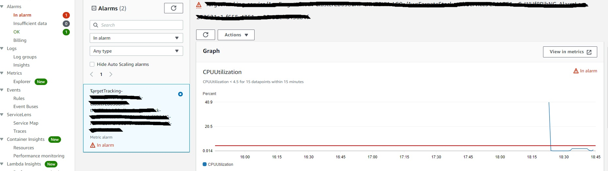

# AWS FARGATE
AWS Fargate is a technology that provides on-demand, right-sized compute capacity for containers. With AWS Fargate, you no longer have to provision, configure, or scale groups of virtual machines to run containers. This removes the need to choose server types, decide when to scale your node groups, or optimize cluster packing.

# Cluster
An Amazon ECS cluster is a logical grouping of tasks or services.

# Amazon VPC
You run a ecs cluster instance on a virtual private cloud (VPC) using the Amazon Virtual Private Cloud (Amazon VPC) service. When you use a VPC, you have control over your virtual networking environment.

# Task Definition
A task definition is required to run Docker containers in Amazon ECS.We can define multiple containers in a task definition.

# Install Dependencies 
npm install @aws-cdk/aws-ecs @aws-cdk/aws-ec2 @aws-cdk/aws-iam

# Create VPC
```javascript
    const vpc = new ec2.Vpc(this, 'MyVPC', { maxAzs: 2 }); // NOTE: Limit AZs(avaliable zones) to avoid reaching resource quotas
```

# Create Cluster 
``` javascript 
    const cluster = new ecs.Cluster(this, 'Cluster', {
      vpc: vpc, 
      containerInsights: true // enable cloudwatch insights for this cluster
    });
```

# Task Definition 

``` javascript 

    const taskrole = new iam.Role(this, "ecsTaskExecutionRole", {
      assumedBy: new iam.ServicePrincipal("ecs-tasks.amazonaws.com"),
    });

    taskrole.addManagedPolicy(
      iam.ManagedPolicy.fromAwsManagedPolicyName(
        "service-role/AmazonECSTaskExecutionRolePolicy"
      )
    );

    const fargateTaskDefinition = new ecs.FargateTaskDefinition(this, 'TaskDef', {
      memoryLimitMiB: 512, // assign memory for the task
      cpu: 256, // assign cpu for the task 
      taskRole: taskrole // give task the execution policy
    });
    
```

# Create Container 
To build a container we have to provide an image. For this tutorial we are using a simple hello world nodejs app running on port 80. cdk deploy automatically build the image and uploads it to ECR. [follow this tutorial to dockerize a nodejs app](https://nodejs.org/en/docs/guides/nodejs-docker-webapp/) or you can use the image provided local-img directory.
``` javascript 

    const container = fargateTaskDefinition.addContainer("WebContainer", {
      //ecs.ContainerImage.fromRegistry("amazon/amazon-ecs-sample") use this for default img provided by aws for testing.
      image: ecs.ContainerImage.fromAsset(__dirname + '/../local-image'), // this image will be built and uploaded to ECR.
      
    });

    container.addPortMappings({
      containerPort: 80, //open port 80 to visit website
      hostPort: 80
    })

```

# Create Security Group 
Behind the scene Fargate functions on EC2 so we need to edit our ec2 security group to allow public access.

``` javascript
    const securityGroup = new ec2.SecurityGroup(this, 'webContainer', { 
      vpc, 
      allowAllOutbound: true, // allow container to send request to ECR where our image is stored.
    });
    // edit inbound rules to allow all traffic to port 80
    securityGroup.addIngressRule(ec2.Peer.anyIpv4(), ec2.Port.tcp(80))
```
# Create Fargate Service 
ECS provides us the choice to use either the EC2 or Fargate for our cluster and task. We are using Fargate for this example

``` javascript 
    //create service for the fargate task
    const fargateService = new ecs.FargateService(this, 'webService', { 
      cluster,
      taskDefinition: fargateTaskDefinition,
      assignPublicIp: true, // assign public ip so we can access our nodejs app
      securityGroup,
      desiredCount: 1 // count of task(default is 1)
    })

```

# Auto Scaling 
Autoscaling is very important to making sure that your services stay online when traffic increases unexpectedly. In both EC2 and AWS Fargate one way to ensure your service autoscales is to increase and decrease the number of copies of your application(based on cpu/memory usage) container that are running in the cluster.

``` javascript 
    const scaling = fargateService.autoScaleTaskCount({
      maxCapacity: 2 // define max capacity of task
    })

    scaling.scaleOnCpuUtilization('CpuScaling', { // scale on memory is also available.
      targetUtilizationPercent: 10, // 10 is good for testing for production 50 and above would be appropriate.
      scaleInCooldown: cdk.Duration.seconds(60), //Scale-in cooldown period
      scaleOutCooldown: cdk.Duration.seconds(60)
    });
```

# Testing 
After your service is configured with Service Auto Scaling, you can trigger a scaling activity by pushing your service's CPU utilization into the ALARM state. Because the example in this tutorial is a web application you can send thousands of HTTP requests to your service (using the ApacheBench utility) to spike the service CPU utilization above the threshold amount. This spike should trigger the alarm.

## Installation: 

### Linux and MacOS:
This command is installed by default on macOS, and it is available for many Linux distributions, as well. For example, you can install ab on Amazon Linux with the following command:
```javascript 
$ sudo yum install -y httpd24-tools
```

### Windows: 
1. [download apache binaries from an apache recommended download site](https://www.apachelounge.com/download/)
2. extract the content using zip tool
3. copy the /bin/ab.exe to a folder of your choice (i.e.: c:\temp)
4. start a command prompt and run it

## Run Test: 
1. -c is concurrent clients
2. -n is the number of requests to run in the test
``` javascript 
ab -n 100000 -c 1000 http://your-container-ip/
```

## Result: 
From cloudWatch we can from the graph as the load crosses the limit the container scales in and cpu utilization drops to below the specified value(10).


# Reference
[AWS Fargate Docs](https://docs.aws.amazon.com/AmazonECS/latest/developerguide/AWS_Fargate.html)
[AWS Fargate CDK API](https://docs.aws.amazon.com/cdk/api/latest/docs/@aws-cdk_aws-ecs.FargateService.html)

# Welcome to your CDK TypeScript project!

This is a blank project for TypeScript development with CDK.

The `cdk.json` file tells the CDK Toolkit how to execute your app.

## Useful commands

 * `npm run build`   compile typescript to js
 * `npm run watch`   watch for changes and compile
 * `npm run test`    perform the jest unit tests
 * `cdk deploy`      deploy this stack to your default AWS account/region
 * `cdk diff`        compare deployed stack with current state
 * `cdk synth`       emits the synthesized CloudFormation template
