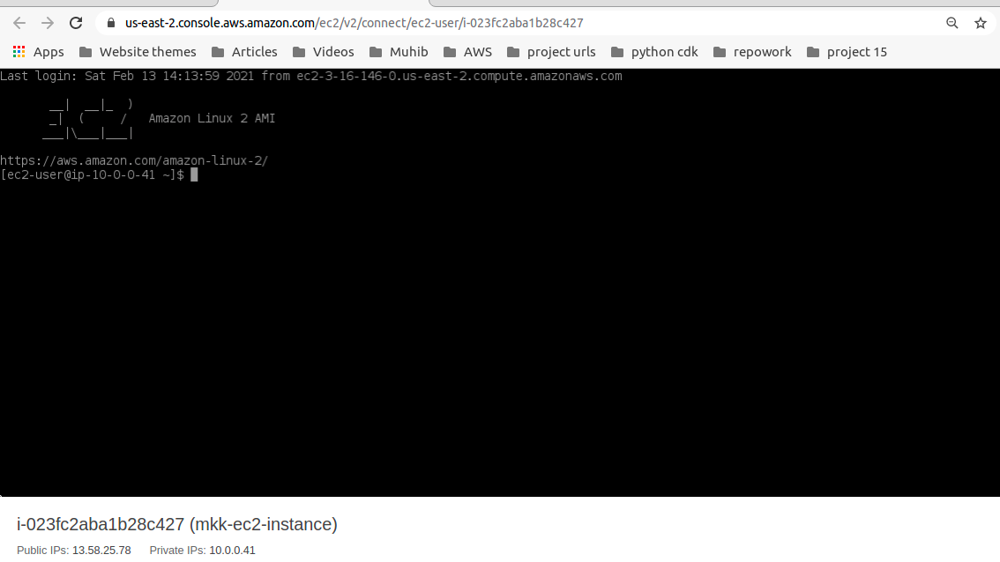
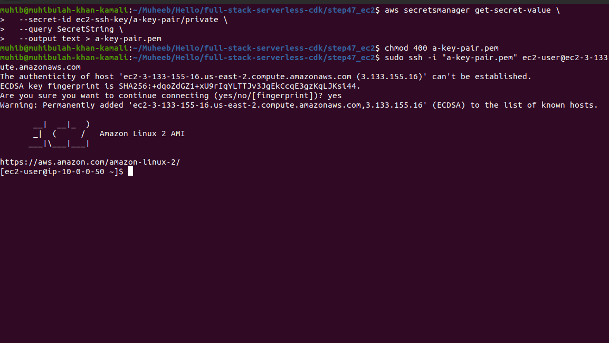
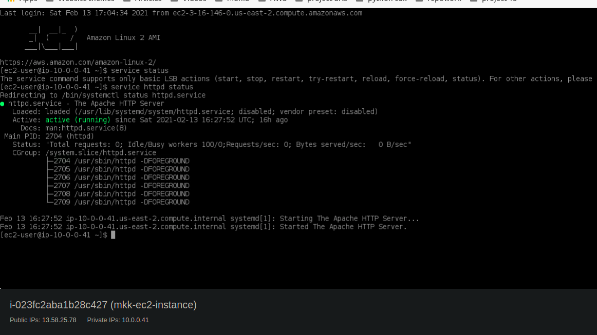
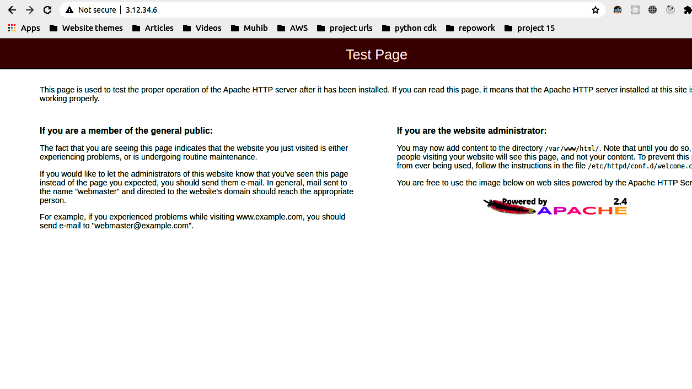

# AWS EC2 (Elastic compute cloud)
Amazon Elastic Compute Cloud (EC2) is a part of Amazon Web Services (AWS), that allows users to rent virtual computers on which to run their own computer applications. EC2 encourages scalable deployment of applications by providing a web service through which a user can boot an Amazon Machine Image (AMI) to configure a virtual machine, which Amazon calls an "instance", containing any software desired. A user can create, launch, and terminate server-instances as needed, paying by the second for active servers – hence the term "elastic". EC2 provides users with control over the geographical location of instances that allows for latency optimization and high levels of redundancy.In November 2010, Amazon switched its own retail website platform to EC2 and AWS

[read more about EC2](https://docs.aws.amazon.com/AWSEC2/latest/UserGuide/concepts.html)

# VPC
Amazon Virtual Private Cloud (Amazon VPC) enables you to launch AWS resources into a virtual network that you've defined. This virtual network closely resembles a traditional network that you'd operate in your own data center, with the benefits of using the scalable infrastructure of AWS.

[What is VPC?](https://aws.amazon.com/vpc/?vpc-blogs.sort-by=item.additionalFields.createdDate&vpc-blogs.sort-order=desc)

# Subnet
The practice of dividing a network into two or more networks is called subnetting. AWS provides two types of subnetting one is Public which allow the internet to access the machine and another is private which is hidden from the internet. Instance is a virtual server in the AWS cloud.

[what is subnet and subnet groups](https://docs.aws.amazon.com/AmazonElastiCache/latest/mem-ug/SubnetGroups.html)

[Why we using subnets and vpcs?](https://docs.aws.amazon.com/vpc/latest/userguide/VPC_Subnets.html)

# Security group
A security group acts as a virtual firewall for your EC2 instances to control incoming and outgoing traffic. ... If you don't specify a security group, Amazon EC2 uses the default security group. You can add rules to each security group that allow traffic to or from its associated instances.

[Read more about Security groups](https://docs.aws.amazon.com/vpc/latest/userguide/VPC_SecurityGroups.html)

# AMI (Amazon machiine images)
An Amazon Machine Image (AMI) provides the information required to launch an instance. You must specify an AMI when you launch an instance. You can launch multiple instances from a single AMI when you need multiple instances with the same configuration. You can use different AMIs to launch instances when you need instances with different configurations.

[AMI Documentation](https://docs.aws.amazon.com/AWSEC2/latest/UserGuide/AMIs.html)

# Install Dependencies 
npm install @aws-cdk/aws-ec2

npm i cdk-ec2-key-pair

# Create VPC
A virtual private cloud (VPC) is a virtual network dedicated to your AWS account. It is logically isolated from other virtual networks in the AWS Cloud. You can launch your AWS resources, such as Amazon EC2 instances, into your VPC.

When you create a VPC, you must specify a range of IPv4 addresses for the VPC in the form of a Classless Inter-Domain Routing (CIDR) block; for example, 10.0.0.0/16. This is the primary CIDR block for your VPC. For more information about CIDR notation, [see](https://docs.aws.amazon.com/vpc/latest/userguide/VPC_Subnets.html)
```javascript
    const vpc = new ec2.Vpc(this, 'VPC', {
      subnetConfiguration: [
        {
          cidrMask: 26,
          name: 'Public',
          subnetType: ec2.SubnetType.PUBLIC, //we want to access our server from internet that's why using PUBLIC
        }
      ]
    });
```

# Create Security Group 
``` javascript 
    // Open port 22 for SSH connection from anywhere
    const mySecurityGroup = new ec2.SecurityGroup(this, 'SecurityGroup', {
      vpc,
      securityGroupName: "my-test-sg",
      description: 'Allow ssh access to ec2 instances from anywhere',
      allowAllOutbound: true
    });
    mySecurityGroup.addIngressRule(ec2.Peer.anyIpv4(), ec2.Port.tcp(22), 'allow public ssh access')
```

# Create AMI
``` javascript 
    // We are using the latest AMAZON LINUX AMI
    const awsAMI = new ec2.AmazonLinuxImage({ generation: ec2.AmazonLinuxGeneration.AMAZON_LINUX_2 }); 
```

# Define Instance Details
``` javascript 
    // Instance details
    //use instance class T3 and instance size micro coz it's in free tier m
    new ec2.Instance(this, 'Instance', {
      vpc,
      instanceType: ec2.InstanceType.of(ec2.InstanceClass.T3, ec2.InstanceSize.NANO),
      machineImage: awsAMI,
      securityGroup: mySecurityGroup
    }); 
```

# Deploy
``` javascript 
    $ sudo npm run build && cdk deploy
```

## Accessing instance from Console:

1. Go to ec2 dashboard (https://us-east-2.console.aws.amazon.com/ec2/v2/home?region=us-east-2#Home:)
2. Select instance (only ruuning one)
3. then on top press connect button
4. you will be watching 3 options select EC2 instance connect
5. without changing press connect

## Result: 


## Accessing instance from Linux Machine:
We need a key-pair value to access ec2 instance from linux machine

[Key-pair value and ec2 instance](https://docs.aws.amazon.com/AWSEC2/latest/UserGuide/ec2-key-pairs.html)

[Access ec2 instance from windows](https://docs.aws.amazon.com/AWSEC2/latest/UserGuide/putty.html)

# Create key-pair:
``` javascript 
     // Create the Key Pair
    const key = new KeyPair(this, 'A-Key-Pair', {
      name: 'a-key-pair',
      description: 'This is a Key Pair',
      storePublicKey: true, // by default the public key will not be stored in Secrets Manager
    });
```
# Download key-pair:
``` javascript
aws secretsmanager get-secret-value \
  --secret-id ec2-ssh-key/a-key-pair/private \
  --query SecretString \
  --output text > a-key-pair.pem
```
# Open Terminal:
``` javascript
    ssh -i "a-key-pair.pem" ec2-user@ec2-3-133-155-16.us-east-2.compute.amazonaws.com
```
# Result:


# Setup Server
``` javascript 
    $ sudo su //need to give first root access
```
``` javascript 
    $ yum install httpd -y //it setup the apache web server
```
``` javascript 
    $ service httpd status//not active 
```
``` javascript 
    $ service httpd start//it starts server
```
## You can see running status active


## Result: 
Paste your public IP in another tab.you'll see there apache server running


## Useful commands
``` javascript 
    $ curl http://169.254.169.254/latest/meta-data/ //this command gives you all meta-data of your instance
```
Now Stop the server
``` javascript 
    $ service httdp stop //this command stop the server
```

## Destroy
``` javascript 
    $ cdk destroy 
```

# Reference
[AWS EC2 docs](https://docs.aws.amazon.com/cdk/api/latest/docs/aws-ec2-readme.html)

# Welcome to your CDK TypeScript project!

This is a blank project for TypeScript development with CDK.

The `cdk.json` file tells the CDK Toolkit how to execute your app.

## Useful commands

 * `npm run build`   compile typescript to js
 * `npm run watch`   watch for changes and compile
 * `npm run test`    perform the jest unit tests
 * `cdk deploy`      deploy this stack to your default AWS account/region
 * `cdk diff`        compare deployed stack with current state
 * `cdk synth`       emits the synthesized CloudFormation template