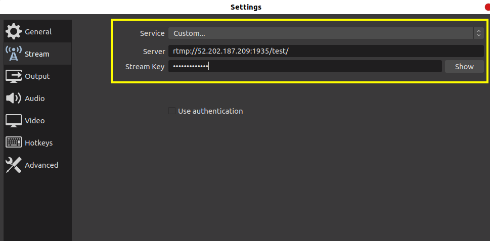

# AWS Elemental MediaLive!
AWS Elemental MediaLive is a video processing service that enables video providers to encode high-quality live video streams for delivery to broadcast televisions and multiscreen devices. Used as a standalone service or integrated with other AWS Media Services, AWS Elemental MediaLive lets you build flexible 24x7 live video workflows or create event-based live streams with full control over encoding parameters.

## MediaLive API / Documentation Referenc
https://docs.aws.amazon.com/medialive/latest/ug/what-is.html

## Warning
This CDK stack doesn't automatically start its medialive channel. AWS charges for a medialive "live/started" channel whether you are using it or not, so you must start manually using Console, CLI or SDK. Check prices here: https://aws.amazon.com/medialive/pricing/
Don't forget and leave your medialive channel opened, AWS will charge you!
Before destroying this Stack, you must stop your LiveChannel, otherwise CloudFormation will generate an error.

## Pricing Chart.
https://aws.amazon.com/medialive/pricing/#Add-On_Functionality

## NPM install.
- npm install @aws-cdk/aws-medialive @aws-cdk/aws-mediapackage @aws-cdk/aws-iam
- cdk bootstrap && npm run build && cdk deploy

# After Deployment.

## Install Streaming Application
- [Desktop] :  install OBS Studeio https://obsproject.com/download    or
- [MobileApp] : Larix Broadcaster (Android)

## Manually start the Channel 
This Stack doesn't start your channel automatically due to costs, so open MediaLive in the AWS Console and click the Channels link in the sidebar, select "MyLieStream" and  click the orange "start" button in the top right to start the channel. 

** [Remember] to stop your channel after you are done testing, AWS MediaLive will charges per second.

## Setup the Streaming application !

Copy the RTMP link from AWS MediaLive console 

- click on the Input in the site bar and coppe the complete link from "Destination A" ... like [rtmp://52.202.187.209:1935/test/bootCamp123]	 (streaming key : bootCamp123)

## OBS Studio setup

Select the source (camera/screen) and click on "setting"

Copy the RTMP link 

### Testing
Copy the Playback URL (you can check from console  mediaPackage/channel_Name/Endpoints Url)

## Mobile Application

Setting > Connections > New Connection >
name : abcd
url : rtmp://52.202.187.209:1935/test/bootCamp123

save & start recording

## Useful commands

 * `npm run build`   compile typescript to js
 * `npm run watch`   watch for changes and compile
 * `npm run test`    perform the jest unit tests
 * `cdk deploy`      deploy this stack to your default AWS account/region
 * `cdk diff`        compare deployed stack with current state
 * `cdk synth`       emits the synthesized CloudFormation template

