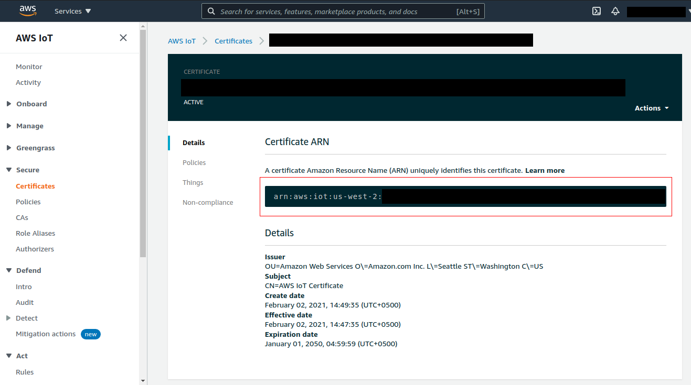
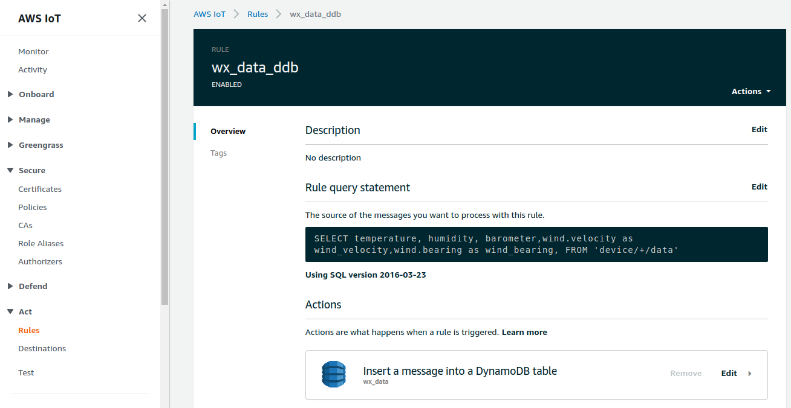
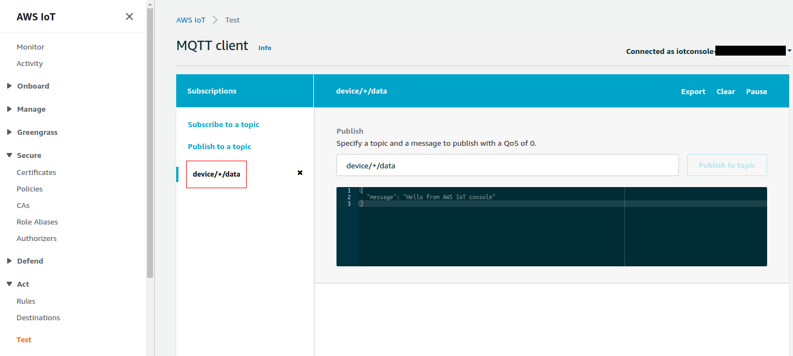
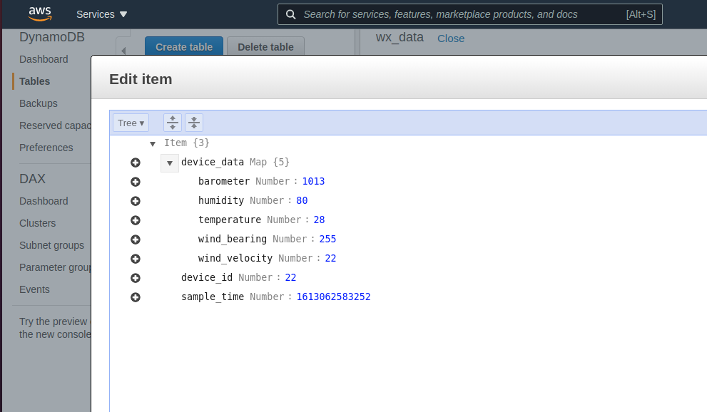

# What is AWS IoT Core?

AWS IoT Core lets you connect IoT devices to the AWS cloud without the need to provision or manage servers. AWS IoT Core can support billions of devices and trillions of messages, and can process and route those messages to AWS endpoints and to other devices reliably and securely. With AWS IoT Core, your applications can keep track of and communicate with all your devices, all the time, even when they aren’t connected.

# AWS IoT Core capabilities

<h5>Publish and subscribe to messages with message broker</h5>

The Message Broker is a high throughput publish/subscribe (pub/sub) message broker that securely transmits messages to and from all of your IoT devices and applications with low latency. AWS IoT Core supports devices and clients that use the MQTT and the MQTT over WSS protocols to pub/sub to messages, and devices and clients that use the HTTPS protocol to publish messages.


# Here's how you can get started with AWS IoT Core.

<h3> Step 1 (Create X.509 client certificate) </h3>

X.509 certificates provide AWS IoT with the ability to authenticate client and device connections.Client certificates must be
registered with AWS IoT before a client can communicate with AWS IoT. A client certificate can be registered
in multiple AWS accounts in the same AWS Region to facilitate moving
devices between your AWS accounts in the same region. See <a href="https://docs.aws.amazon.com/iot/latest/developerguide/x509-client-certs.html#multiple-account-cert">Using X.509 client certificates in multiple AWS accounts with multi-account registration</a>
for more information

This command creates private key, public key, and X.509 certificate files and registers and activates the certificate with AWS IoT.
<pre><code>aws iot create-keys-and-certificate \
    --set-as-active \
    --certificate-pem-outfile certificate_filename \
    --public-key-outfile public_key_filename \
    --private-key-outfile private_key_filename
</code></pre>


<h3> Step 2 (Create a thing and its policy)</h3>

The following code create a thing in the AWS IoT Core console. 
You can't change a thing's name after you create it. To change a thing's name, you must create a
new thing, give it the new name, and then delete the old thing.

```typescript
const thingName = 'MyLightBulb';
    const thing = new iotCore.CfnThing(this,"iotThing",{
      thingName:thingName,
      attributePayload:{
        "attributes":{"wattage":"75"}
      }
    });
```

To create an AWS IoT policy that allows client to connect and send messages to AWS IoT.

```typescript
const policyName = 'MyLightBulb-policy'
    const myPolicy = new iotCore.CfnPolicy(this,"iotThingPolicy",{
      policyName:policyName,
      policyDocument: {
        Version: '2012-10-17',
        Statement: [
            {
                Effect: 'Allow',
                Action: 'iot:Connect',
                Resource:`arn:aws:iot:${cdk.Aws.REGION}:${cdk.Aws.ACCOUNT_ID}:thing/${thing.thingName}`,
            },
            {
                Effect: 'Allow',
                Action: 'iot:Subscribe',
                Resource:`arn:aws:iot:${cdk.Aws.REGION}:${cdk.Aws.ACCOUNT_ID}:thing/${thing.thingName}`,
            },
            {
                Effect: 'Allow',
                Action: [
                    'iot:Publish',
                    'iot:Receive',  
                ],
                Resource:`arn:aws:iot:${cdk.Aws.REGION}:${cdk.Aws.ACCOUNT_ID}:thing/${thing.thingName}`,
              },
        ]
        },
    })
```

<h3> Step 3 (Attached Principal to thing and its policy)</h3>

Attaches the specified principal to the specified thing.
A principal can be X.509 certificates, IAM users, groups, and roles, Amazon Cognito identities or federated identities.

<b>Note: before attaching principal to thing. make sure you created certificate and thing</b> then pass the certificate ARN in principal attribute

``` typescript
const thingPrincipal = new iotCore.CfnThingPrincipalAttachment(this,"myThingPrincipal",{
      principal:'your-certificate-ARN',
      thingName:thingName

    })
```
to find the certificate ARN navigate to <a href="https://us-west-2.console.aws.amazon.com/iot/home?region=us-west-2#/home">aws Iot Core Console</a> in the left menu bar navigate to secure then certificates. In this window you can find your certificate which you created in Step 1. Click on it under the Certificate ARN heading you can find it.



Attaches the specified principal to the specified policy.

<b>Note: before attaching principal to Policy. make sure you created certificate and policy</b> then pass the certificate ARN in principal attribute
``` typescript
const policyPrincipal = new iotCore.CfnPolicyPrincipalAttachment(this,"myPolicyPrincipal",{
      policyName:policyName,
      principal:'your-certificate-ARN',
    })
```
<h3> Step 4 (Create DynamoDb Table)</h3>

create dynamoDb Table with these attributes to record the data from the imaginary weather sensor devices
<ul>
    <li>sample_time is a primary key and describes the time the sample was recorded.</li>
    <li>device_id is a sort key and describes the device that provided the sample</li>
    <li>device_data is the data received from the device and formatted by the rule query statement</li>
</ul>

``` typescript
 const dynamoDBTable = new ddb.Table(this, 'Table', {
      tableName:'wx_data',
      partitionKey: {
        name: 'sample_time',
        type: ddb.AttributeType.NUMBER,
      },
      sortKey:{
        name: 'device_id',
        type: ddb.AttributeType.NUMBER,
      }
    });
```
You'll define device_data later, when you configure the DynamoDB rule action.

<h3> Step 5 (Create role for iot to access dynamoDb)</h3>

``` typescript
const role = new iam.Role(this, 'wx_ddb_role', {
    assumedBy: new iam.ServicePrincipal('iot.amazonaws.com'),
});

///Attaching DynamoDb access to policy
const policy = new iam.PolicyStatement({
    effect: iam.Effect.ALLOW,
    actions: ['dynamodb:*'],
    resources: ['*']
});

//granting IAM permissions to role
role.addToPolicy(policy);
```
<h3> Step 6 (Create the AWS IoT rule to send data to the DynamoDB table)</h3>

AWS IoT rules send data from your devices to other AWS services. They listen for specific MQTT messages, format the data in the message
payloads, and send the result to other AWS services.

``` typescript
// In this rule, you'll also use a couple of Substitution templates.
// Substitution templates are expressions that let you insert dynamic values from functions and message data.
const dynamoDbRule = new iotCore.CfnTopicRule(this, 'wx_data_ddb', {
  ruleName:'wx_data_ddb',
  topicRulePayload: {
    ruleDisabled: false,
      sql: `SELECT temperature, humidity, barometer,
              wind.velocity as wind_velocity,
              wind.bearing as wind_bearing,
            FROM 'device/+/data'`,
      awsIotSqlVersion: '2016-03-23',
      actions: [
          {
              dynamoDb : {
                  tableName:"wx_data",
                  hashKeyField:'sample_time', // dynamoDb table Partition Key
                  hashKeyValue:'${timestamp()}', // dynamoDb table Partition Key value
                  rangeKeyField:'device_id', // dynamoDb table Sort Key
                  rangeKeyValue:'${cast(topic(2) AS DECIMAL)}', // dynamoDb table Sort Key value
                  payloadField:'device_data', // adding column to dynamoDb table to record the data from the imaginary weather sensor devices
                  roleArn:role.roleArn // assigned role to topicRule to access dynamoDb
              },
          },
      ],
  },
});
```
This Statement : 

```sql
SELECT temperature, humidity, barometer,
  wind.velocity as wind_velocity,
  wind.bearing as wind_bearing,
FROM 'device/+/data'
```

<ul>
    <li>Listens for MQTT messages with a topic that matches the device/+/data topic filter.</li>
    <li>Formats the elements of the wind attribute as individual attributes.</li>
    <li>Passes the temperature, humidity, and barometer attributes unchanged.</li>
</ul>

<b>After you have created Iot Rule. You can find it under Act in the left menu bar</b>



# Test the AWS IoT rule and DynamoDB table
To test the new rule, you'll use the MQTT client to publish and subscribe to the MQTT messages used in this test.
<a href="https://us-west-2.console.aws.amazon.com/iot/home?region=us-west-2#/test">Open the MQTT client in the AWS IoT console</a> in a new window. This will let you edit the rule without losing the configuration of your MQTT client. The MQTT client does not retain any subscriptions or
message logs if you leave it to go to another page in the console. You'll also want a separate console
window open to the <a href="https://us-west-2.console.aws.amazon.com/dynamodb/home?region=us-west-2#tables:">DynamoDB Tables hub in the AWS IoT console</a> to view the new entries that your rule sends.

<h3>To use the MQTT client to test your rule</h3>

<ol>
  <li>In the <a href="https://us-west-2.console.aws.amazon.com/iot/home?region=us-west-2#/test">MQTT client in the AWS IoT console</a>, subscribe to the input topic, device/+/data.
    <ul>
      <li>In the MQTT client, under Subscriptions, choose Subscribe to a topic.</li>
      <li>In Subscription topic, enter the topic of the input topic filter, <b>device/+/data</b>.</li>
      <li>Keep the rest of the fields at their default settings.</li>
      <li>Choose Subscribe to topic.</li>
       In the Subscriptions column, under Publish to a topic, <b>device/+/data</b> appears.
       You should see the message that you sent in the <b>device/+/data</b> subscription.
    </ul>
      <br>
      
  </li>
    <li>Publish a message to the input topic with a specific device ID, <b>device/22/data</b>. You can't publish to MQTT topics that contain wildcard characters.
      <ul>
          <li>In the MQTT client, under Subscriptions, choose Publish to topic.</li>
          <li>In the Publish field, enter the input topic name, <b>device/22/data</b>.</li>
          <li>Copy the sample data shown here and, in the edit box below the topic name, paste the sample data and to publish the MQTT message, choose Publish to topic.</li>
          <pre><code>
{
  "temperature": 28,
  "humidity": 80,
  "barometer": 1013,
  "wind": {
    "velocity": 22,
    "bearing": 255
  }
}
          </code></pre>
      </ul>
        <br>
  </li>
    <li>Check to see the row in the DynamoDB table that your rule created.
        <ul>
            <li>In the <a href="https://us-west-2.console.aws.amazon.com/dynamodb/home?region=us-west-2#tables:">DynamoDB Tables hub in the AWS IoT console</a>,                   choose wx_data, and then choose the Items tab.</li>
            If you're already on the Items tab, you might need to refresh the display by choosing the refresh icon in the upper-right corner of the table's                   header.
            <li>Notice that the sample_time values in the table are links and open one. If you just sent your first message, it will be the only one in the list.                 This link displays all the data in that row of the table.
            </li>
            <li>Expand the device_data entry to see the data that resulted from the rule query statement.</li>
        </ul>
        <br>
      
  </li>
</ol>

# Useful Links
<ul>
    <li><h3><a href="https://aws.amazon.com/iot-core/">AWS IoT Core</a></h3></li>
    <li><h3><a href="https://docs.aws.amazon.com/iot/latest/developerguide/what-is-aws-iot.html">Developer Guide</a></h3></li>
    <li><h3><a href="https://docs.aws.amazon.com/cli/latest/reference/iot/">AWS CLI Command Reference</a></h3></li>
    <li><h3><a href="https://docs.aws.amazon.com/cdk/api/latest/docs/aws-iot-readme.html">AWS CDK</a></h3></li>
    <li><h3><a href="https://docs.aws.amazon.com/iot/latest/developerguide/iot-sdks.html">AWS IoT Device SDKs</a></h3>
    </li>
<ul>


# Welcome to your CDK TypeScript project!

This is a blank project for TypeScript development with CDK.

The `cdk.json` file tells the CDK Toolkit how to execute your app.

## Useful commands

 * `npm run build`   compile typescript to js
 * `npm run watch`   watch for changes and compile
 * `npm run test`    perform the jest unit tests
 * `cdk deploy`      deploy this stack to your default AWS account/region
 * `cdk diff`        compare deployed stack with current state
 * `cdk synth`       emits the synthesized CloudFormation template
