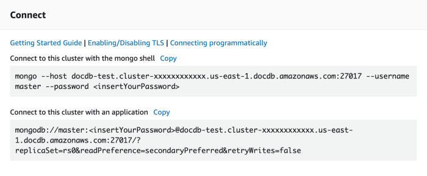

# AWS DocumentDB 
Amazon DocumentDB (with MongoDB compatibility) is a fast, scalable, highly available, and fully managed document database service that supports MongoDB workloads. As a document database, Amazon DocumentDB makes it easy to store, query, and index JSON data.Amazon DocumentDB is a non-relational database service designed from the ground-up to give you the performance, scalability, and availability you need when operating mission-critical MongoDB workloads at scale. In Amazon DocumentDB, the storage and compute are decoupled, allowing each to scale independently, and you can increase the read capacity to millions of requests per second by adding up to 15 low latency read replicas in minutes, regardless of the size of your data.

[DocumentDB in detail](https://docs.aws.amazon.com/AWSEC2/latest/UserGuide/concepts.html)

[Read about JSON data](https://aws.amazon.com/documentdb/what-is-json/)


# VPC
Amazon Virtual Private Cloud (Amazon VPC) enables you to launch AWS resources into a virtual network that you've defined. This virtual network closely resembles a traditional network that you'd operate in your own data center, with the benefits of using the scalable infrastructure of AWS.

[What is VPC?](https://aws.amazon.com/vpc/?vpc-blogs.sort-by=item.additionalFields.createdDate&vpc-blogs.sort-order=desc)

## what is vpcCidr(Vartual Private Cloud Classless Inter-Domain Routing )
A virtual private cloud (VPC) is a virtual network dedicated to your AWS account.When you create a VPC, you must specify a range of IPv4 addresses for the VPC in the form of a Classless Inter-Domain Routing (CIDR) block; for example, 10.0.0.0/21 . This is the primary CIDR block for your VPC.

# Subnet
The practice of dividing a network into two or more networks is called subnetting. AWS provides two types of subnetting one is Public which allow the internet to access the machine and another is private which is hidden from the internet. Instance is a virtual server in the AWS cloud.

[what is subnet and subnet groups](https://docs.aws.amazon.com/AmazonElastiCache/latest/mem-ug/SubnetGroups.html)

[Why we using subnets and vpcs?](https://docs.aws.amazon.com/vpc/latest/userguide/VPC_Subnets.html)

# Security group
A security group acts as a virtual firewall for your EC2 instances to control incoming and outgoing traffic. ... If you don't specify a security group, Amazon EC2 uses the default security group. You can add rules to each security group that allow traffic to or from its associated instances.

[Read more about Security groups](https://docs.aws.amazon.com/vpc/latest/userguide/VPC_SecurityGroups.html)

# DocDB Cluster
Amazon DocumentDB separates compute and storage, and offloads data replication and backup to the cluster volume. A cluster volume provides a durable, reliable, and highly available storage layer that replicates data six ways across three Availability Zones. Replicas enable higher data availability and read scaling. Each cluster can scale up to 15 replicas.

[Understanding Clusters](https://docs.aws.amazon.com/documentdb/latest/developerguidedb-clusters-understanding.html)


The instance class determines the computation and memory capacity of an Amazon DocumentDB (with MongoDB compatibility) instance. The instance class you need depends on your processing power and memory requirements.
Amazon DocumentDB supports the R4, R5, and T3 families of instance classes. These classes are current-generation instance classes that are optimized for memory-intensive applications. For the specifications on these classes [Click Here](https://docs.aws.amazon.com/documentdb/latest/developerguide/db-instance-classes.html)

# Install Dependencies 
``` javascript 
    npm install @aws-cdk/aws-ec2
    npm install @aws-cdk/aws-docdb
    npm install dotenv
```

# Create VPC
A virtual private cloud (VPC) is a virtual network dedicated to your AWS account. It is logically isolated from other virtual networks in the AWS Cloud. You can launch your AWS resources, such as Amazon EC2 instances, into your VPC.

When you create a VPC, you must specify a range of IPv4 addresses for the VPC in the form of a Classless Inter-Domain Routing (CIDR) block; for example, 10.0.0.0/16. This is the primary CIDR block for your VPC. For more information about CIDR notation, [see](https://docs.aws.amazon.com/vpc/latest/userguide/VPC_Subnets.html)

```javascript

        const vpcCidr = "10.0.0.0/21";
        const port = 27017;

        const vpc = new ec2.Vpc(this, "vpc", {
            cidr: vpcCidr,
            subnetConfiguration: [
                {
                    subnetType: ec2.SubnetType.PRIVATE,
                    cidrMask: 24,
                    name: "PrivateSubnet2"
                },
                {
                    subnetType: ec2.SubnetType.PRIVATE,
                    cidrMask: 24,
                    name: "PrivateSubnet1"
                },
                {
                    subnetType: ec2.SubnetType.PUBLIC,
                    cidrMask: 28,
                    name: "PublicSubnet1"
                }
            ]
        });
```

# Create Security Group 
``` javascript 
        const sg = new ec2.SecurityGroup(this, "docdblambdasg", {
            vpc,
            securityGroupName: "docdblambdasg"
        });
```

# Create Subnet Group
``` javascript 
        const subnetGroup = new docdb.CfnDBSubnetGroup(this, "subnetgroup", {
            subnetIds: vpc.privateSubnets.map(x => x.subnetId),
            dbSubnetGroupName: "subnetgroup",
            dbSubnetGroupDescription: "Subnet Group for DocDB"
        });
```

# Create Cluster
``` javascript 
        const dbCluster = new docdb.CfnDBCluster(this, "dbcluster", {
            storageEncrypted: true,
            availabilityZones: vpc.availabilityZones.splice(3),
            dbClusterIdentifier: "docdb",
            masterUsername: "mkkdbuser",
            masterUserPassword: process.env.MASTER_USER_PASSWORD as string,
            vpcSecurityGroupIds: [sg.securityGroupName],
            dbSubnetGroupName: subnetGroup.dbSubnetGroupName,
            port
        });
        dbCluster.addDependsOn(subnetGroup);
```
# Instance Details
``` javascript 
        const dbInstance = new docdb.CfnDBInstance(this, "db-instance", {
            dbClusterIdentifier: dbCluster.ref,
            autoMinorVersionUpgrade: true,
            dbInstanceClass: "db.r5.large",
            dbInstanceIdentifier: "staging",
        });
        dbInstance.addDependsOn(dbCluster);
        sg.addIngressRule(ec2.Peer.ipv4(vpcCidr), ec2.Port.tcp(port));
```

## Print db-url
``` javascript 
        const DB_URL = `mongodb://${dbCluster.masterUsername}:${dbCluster.masterUserPassword}@${dbCluster.attrEndpoint}:${dbCluster.attrPort}`
        new cdk.CfnOutput(this, "db-url", {
            value: DB_URL
        });
```

## Print db-url
make .env on root directory 
``` javascript 
    MASTER_USER_PASSWORD = xxxxxxxxxxxxxx //type your password
```

# Deploy
``` javascript 
    $ sudo npm run build && cdk deploy
```

## Accessing Cluster:
There are two methods to access your cluster
1. via ec2 instacne [see how to create ec2 instance](https://github.com/panacloud-modern-global-apps/full-stack-serverless-cdk/tree/main/step47_ec2)
    - give same vpc in both docdb and ec2
    - after connection of EC2 instance
    - follow step 2

2. Install Mongoshell on machine 
    - Go to (https://us-east-2.console.aws.amazon.com/docdb/home?region=us-east-2#clusters)
    - Open cluster you created 
    - First download the key rds-combined-ca-bundle.pem
    - copy url and paste your password in the command

[Install mongo-shell on linux Ubuntu](https://askubuntu.com/questions/1127055/install-mongodb-shell-client-without-server)

[Install mongo-shell on windows](https://www.guru99.com/installation-configuration-mongodb.html)




## Note:
Run the command after install mongo-shell in your machine

## Destroy
``` javascript 
    $ cdk destroy 
```

# Reference
[CRUD Operations with docdb](https://docs.aws.amazon.com/documentdb/latest/developerguide/document-database-working-with-documents.html)

[Connecting to docdb ](https://medium.com/red-ventures-br-tech/connecting-to-an-aws-documentdb-database-from-outside-its-vpc-648cf56be3b9)

[docdb docs](https://docs.aws.amazon.com/cdk/api/latest/docs/aws-docdb-readme.html)

# Welcome to your CDK TypeScript project!

This is a blank project for TypeScript development with CDK.

The `cdk.json` file tells the CDK Toolkit how to execute your app.

## Useful commands

 * `npm run build`   compile typescript to js
 * `npm run watch`   watch for changes and compile
 * `npm run test`    perform the jest unit tests
 * `cdk deploy`      deploy this stack to your default AWS account/region
 * `cdk diff`        compare deployed stack with current state
 * `cdk synth`       emits the synthesized CloudFormation template