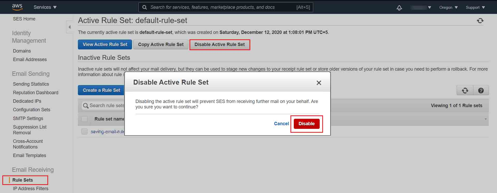
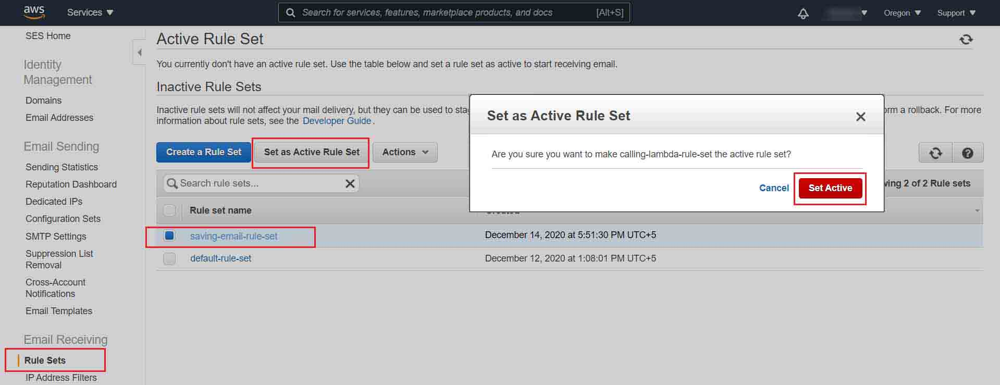
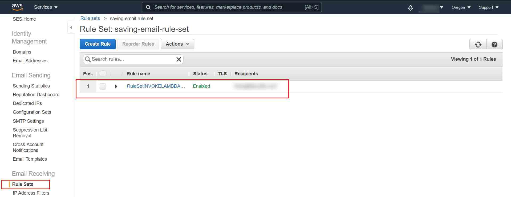
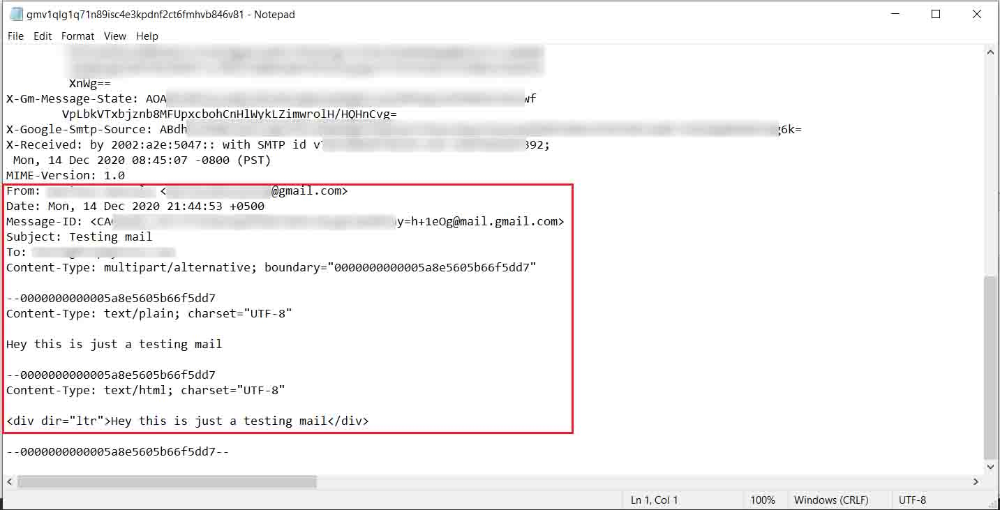

# Saving Received Emails In Amazon S3 On Verified Domain

In this example of CDK deployment we will take a look at [how to receive emails on Amazon email server](https://www.youtube.com/watch?v=2fWj3EKYalg&feature=youtu.be&t=735). For a complete list of Regions where email receiving is supported, see [Amazon Simple Email Service endpoints and quotas](https://docs.aws.amazon.com/general/latest/gr/ses.html) in the AWS General Reference. Currently AWS is supporting email receiving support in three regions **us-east-1**, **us-west-2** and **eu-west-1**. To receive an email through SES we have to consider the following things:

- We should have our own domain.
- Domain should be verified on Amazon SES.
- We should have atleast one rule define to receive email on given verified email addresses.

If you have your own domain than learn [how to verify your domain on AWS SES](https://www.youtube.com/watch?v=j8izLCTBIwg) and follow the steps below to [create a rule set to receive emails](https://youtu.be/nxXIpPZzMd0).

<br>

### Step 1: Setup a CDK directory
`cdk init app --language typescript`

<br>

### Step2: Install The Following Dependencies
`npm install @aws-cdk/aws-s3 @aws-cdk/aws-ses @aws-cdk/aws-ses-actions`

<br>

### Step3: Setup Your CDK Stack
To receive mails in SES we need to define a rule set first and in each rule set you can add many rules. You can create many rule sets but you can only activate one rule set at a time. Inside a rule you have two main options `recipients` and `actions`. inside `recipients` you have to define an email address on which you want to recieve emails and inside `actions` you can add some resource to take action when receive an email on your verified address. For example if you add an email address like **info@example.com** in your rule, so you can only get response when you receive email on this address **info@example.com** which is pretty simple to do with CDK. If you recieved any email on an address which is not available inside your rule than that email will be deleted.

```javascript  
// code to create a rule set
import * as ses from '@aws-cdk/aws-ses';

const ruleSet = new ses.ReceiptRuleSet(this, 'RuleSet', {
      receiptRuleSetName: 'my-rule-set',
    })
```

<br>

In this example we will use Amazon S3 as an action when receive email on verified email address. Add the code below inside your **lib/stact.ts**.

```javascript
// lib/stack.ts
import * as cdk from '@aws-cdk/core';
import * as s3 from '@aws-cdk/aws-s3';
import * as ses from '@aws-cdk/aws-ses';
import * as actions from '@aws-cdk/aws-ses-actions';

export class Stack extends cdk.Stack {
  constructor(scope: cdk.Construct, id: string, props?: cdk.StackProps) {
    super(scope, id, props);

    // The code that defines your stack goes here

    // creating a new bucket to save emails
    const bucket = new s3.Bucket(this, 'Bucket');

    // creating a new rule set
    const ruleSet = new ses.ReceiptRuleSet(this, 'RuleSet', {
      receiptRuleSetName: 'saving-email-rule-set',
    })

    // creating instance for taking email input while deployment
    // ref https://docs.aws.amazon.com/cdk/latest/guide/parameters.html
    const emailAddress = new cdk.CfnParameter(this, 'emailParam', {
      type: 'String', description: "Write your recipient email"
    });

    // Adding a rule inside a rule set
    ruleSet.addRule('INVOKE_LAMBDA_RULE', {
      recipients: [emailAddress.valueAsString], // if no recipients than the action will be called on any incoming mail addresses of verified domains
      actions: [
        new actions.S3({
          bucket,
          objectKeyPrefix: 'emails/', // will save all emails inside emails directory
        })
      ],
      scanEnabled: true, // Enable spam and virus scanning
    })


  }
}
```

<br>

### Step4: Lets deploy
After completing the above steps run the following commands to deploy
- `npm run build`
- `cdk deploy --parameters emailParam=info@example.com`
> Note: your have to replace **info@example.com** with your verified email address

<br>

### Step5: Activate The Rule Set
Now go to your SES console. Click on the **Rule Sets** tab.
You will see by default your **default-rule-set** is already activated, so you have to disable it first, than activate your new rule set which you have created with CDK deployment.

- First disable your **default-rule-set**.
<br>

- Than activate your new rule set.
<br>

- Now you can view the active rule set.
<br>

- You can see your rule set is active now.

<br>

### Step6: Test Your Rule
Now its time to test that your S3 bucked should have the email saved when you received an email on **info@example.com**. To test it you can use any of the free mailing service like **Gmail**, **Yahoo** or any one you like and send an email to **info@example.com** from your email address. In my case I'm using **Gmail**.

<br>

After sending email to your verified domain, go to the S3 console and select your S3 bucket where you will find the received email inside `emails/`.  Download the email file in your system and open with. I'm using Windows so I'm openning it with **Notepad**.

<br>

> **NOTE:** if your are destroying your stack with `cdk destroy` command than make sure that you have disabled your rule set otherwire you will get an error.