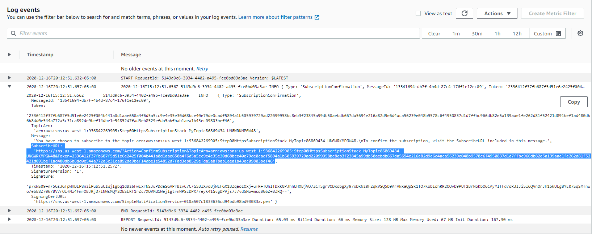

# Subscribing HTTPS to an SNS topic

## Code Explanation

### Creating an HTTPS endpoint using API-gateway and lambda

First we created our HTTPS endpoint by connecting an API-gateway to a lambda function. Whenever the API-gateway is called it sends the request to the lambda and recieves a response from it

```javascript

    // create a lambda function
    const hello = new lambda.Function(this, "HelloHandler", {
      runtime: lambda.Runtime.NODEJS_10_X,
      code: lambda.Code.fromAsset("lambda"),
      handler: "hello.handler",
    });

    // create an endpoint for the lambda function
    const api = new apigw.LambdaRestApi(this, "Endpoint", {
      handler: hello,
    });
    
```

### Lambda function's code

The lambda function logs everything that it recieves from the API-gateway and returns a static response.

```javascript

import { APIGatewayProxyEvent, APIGatewayProxyResult, Context } from 'aws-lambda';

export async function handler(event: APIGatewayProxyEvent, context: Context): Promise<APIGatewayProxyResult> {

  // the messages sent by SNS are recieved in the event's body
  const data = JSON.parse(event.body!)

  // we are logging the data coming from SNS. You can view it in the cloudWatch log events.
  console.log(data)
 
  return {
    statusCode: 200,
    headers: { "Content-Type": "text/plain" },
    body: `Hello World`
  };
}
```

### Creating an SNS topic

We then created an SNS topic so that our HTTPS endpoint can subsribe to it

```javascript

    // create an SNS topic
    const myTopic = new sns.Topic(this, "MyTopic");
```

### Subscribing HTTPS to the topic


We have not added any filter policies or dead letter queues in this step. We have only added one parameter here that sets the subscription protocol to "HTTPS" 

```javascript

  // The following command subscribes our endpoint(connected to lambda) to the SNS topic
    myTopic.addSubscription(
      new subscriptions.UrlSubscription(api.url, {
        protocol: SubscriptionProtocol.HTTPS
      })
    );
```


## Usage

When you will deploy the given code, the SNS would send a subscription link to the subscribed HTTPS endpoint. You will have to open that link once to complete the subscription process and start recieving the messages from SNS topic.

Your lambda function would recieve the subscription link and you would be able to find it in the logs (because we are logging all the events from our lambda function)


>subscription url:

>  


After clicking this link you can start publishing messages from your SNS console and you would be able to see the recieved messages in the lambda function's cloud watch logs
