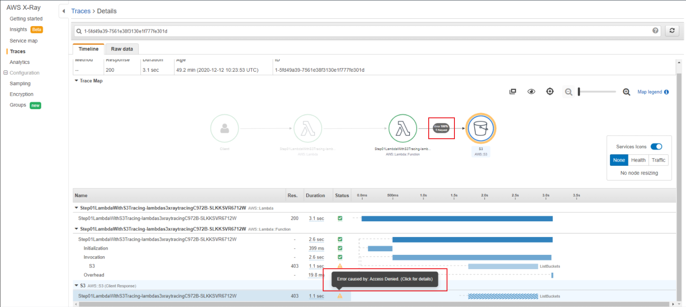

## Introduction

In this step, we are going to take [Step00](https://github.com/panacloud-modern-global-apps/full-stack-serverless-cdk/tree/main/stepxx_x-ray/step00_simple_lambda_tracing) to the next level by adding a new s3 node in the service map. and also figure out the error with the help of AWS X-Ray.

## Step 1

Install the following packages

```bash
npm install aws-sdk
npm install aws-xray-sdk-core
```

## Step 2

update the lambda function handler code (`lambda/app.ts`)

```javascript
import * as AWS from "aws-sdk";
import * as AWSXRay from "aws-xray-sdk-core";

import { APIGatewayEvent } from "aws-lambda";

exports.handler = (event: APIGatewayEvent) => {
  //variable that uses the sdk to record any s3 bucket activity in this application
  const s3 = AWSXRay.captureAWSClient(new AWS.S3());

  //this function list all the s3 buckets
  s3.listBuckets((err, data) => {
    if (data) {
      console.log("Success", data.Buckets);
    } else {
      console.log("Error", err);
    }
  });
};
```

In the above code, we imported `aws-xray-sdk-core` and create a variable that uses the SDK to record any s3 bucket activity in this application. then we execute a function that lists all the s3 buckets

## Step 3 (Optional)

#### This step is optional just to show you how x-ray helps us to figure out errors.

- Our CDK stack code is the same as in the [X-Ray stepp00](https://github.com/panacloud-modern-global-apps/full-stack-serverless-cdk/tree/main/stepxx_x-ray/step00_simple_lambda_tracing#step-1). we will update it later.
- Build the project and deploy it on cloudformation
- Open your function on lambda console and test it to generate traces on X-Ray
- Go to the `Monitoring` tab on you function select `View traces in X-Ray` it will redirect you to X-Ray Traces.
- Select one of the most recent traces to see detailed trace data resulting from our recent test activity.
- Here you can see the trace shows additional details about the S3 service since we configured our code to report that information. in this case, an access denied error is being reported
  

#### In Our case lambda does not have permission to access S3 bucket.

## Step 4

let's attach the S3 readonly policy to our lambda function with the help of CDK. to do that we have to install IAM package,`npm install @aws-cdk/aws-iam` then update the CDK stack code with the following

```typescript
// lib/step01_lambda_with_s3_tracing-stack.ts

//Create a specific role for Lambda function
const role = new iam.Role(this, "LambdaRole", {
  assumedBy: new iam.ServicePrincipal("lambda.amazonaws.com"),
});

//Attaching s3 read only access to policy
const policy = new iam.PolicyStatement({
  effect: iam.Effect.ALLOW,
  actions: ["s3:Get*", "s3:List*"],
  resources: ["*"],
});

//granting IAM permissions to a role
role.addToPolicy(policy);

new lambda.Function(this, "lambda-s3-x-ray-tracing", {
  runtime: lambda.Runtime.NODEJS_10_X,
  code: lambda.Code.fromAsset("lambda"),
  handler: "app.handler",
  // Enabling X-Ray Tracing
  tracing: lambda.Tracing.ACTIVE,
  role: role,
});
```

#### Now Deploy the stack.

## Step 5

Test the function again and check its most recent trace and you will find that the error resolved and everything should work fine.
